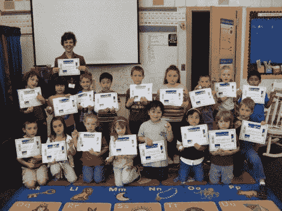

# 只有你能把孩子的球踢到太空

> 原文：<https://hackaday.com/2012/07/27/only-you-can-kick-a-childs-balls-into-space/>

我们对这个标题很感兴趣。当然，当你谈论向太空发射一千个乒乓球时，双关语是无止境的。但这实际上是一个奇妙的倡议，让所有年龄的人都对科学和近空间实验感到兴奋。约翰·鲍威尔为学生提供了将实验送入太空的机会。他正在启动下一次发布，计划在九月进行。通过这种方式，每个参赛者都可以免费放飞他们的项目，然后一旦基于气象气球的硬件恢复，就可以获得结果和证书。

这个程序有一个大小限制。每个实验都必须适合乒乓球的大小。但是你会惊讶会有什么成就。[John]报道说，最简单而有趣的项目是在球内放置一个小棉花糖。当它上升穿过大气层时，它将增长到充满整个球体，然后被极端温度冷冻干燥。有些并不那么低科技。有一个小 PCB 的图像，上面有一个 DS1337 和一些传感器。这是一个大气数据记录器，它将在返回时提供大量信息进行分析。

[via [被黑的小工具](http://hackedgadgets.com/2012/07/26/ping-pong-balls-in-space/)