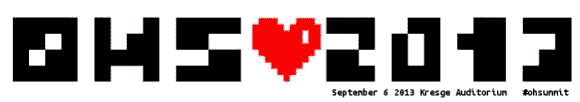
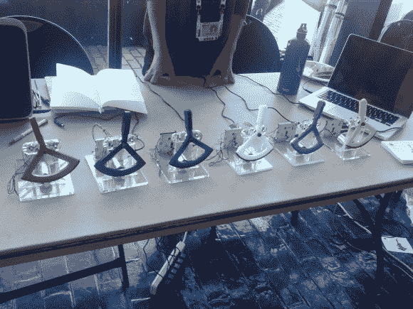
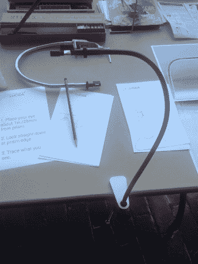
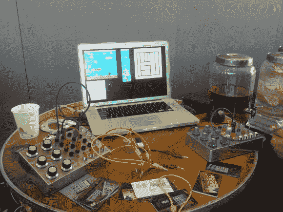
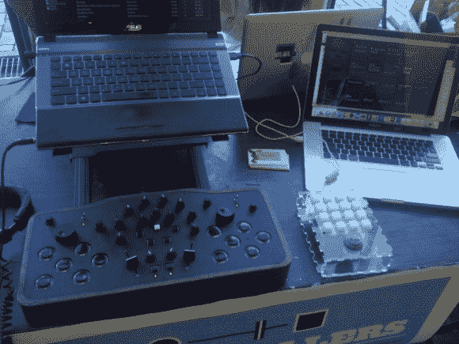
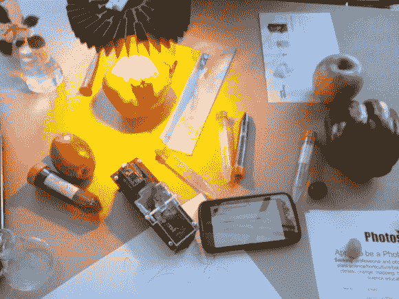
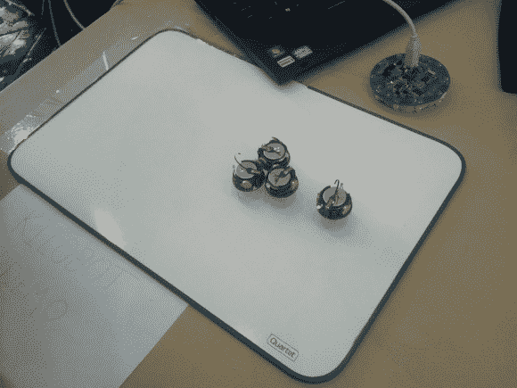

# 开放式硬件峰会 2013–第 1 部分:演示

> 原文：<https://hackaday.com/2013/09/07/open-hardware-summit-2013-part-1-demos/>

2013 年开放硬件峰会于 9 月 6 日在麻省理工学院举行。有各种各样的演示和讲座，涵盖了开放硬件方法和项目。休息之后，我将报道会议的演示区，并分享一些我最喜欢的演示。

演示区是剧院外面的一块空地，赞助商和制造商在这里展示他们的作品。该区域全天开放，在社交时间挤满了人，有 500 名与会者在吃东西和喝饮料。

Hapkit is a 1 DOF haptic feedback system

Hapkit 团队来自湾区，展示了一个单自由度触觉反馈套件。基于 Arduino 的套件使用电机和 H 桥来驱动钟摆，并使用磁阻传感器来检测位置。这使得软件可以让钟摆充当弹簧、点击轮，或者让它基于任意函数做出反应。该工具包将是一个伟大的游戏控制器，或教导控制系统。Hapkit 将在大约一个月后上市，但他们的网站提供了[建造自己的](http://hapkit.stanford.edu/build.html "Hapkit")所需的所有细节。

The NeoLucida is an open source Camera Lucida

NeoLucida 是一款现代的开放式硬件[相机 Lucida](http://en.wikipedia.org/wiki/Camera_lucida "Camera Lucida") 绘图辅助工具。[Pablo]想让他的学生接触这项有 200 年历史的技术，但是照相机 Lucidas 是收藏品，价格超过 300 美元。他用鹅颈管上的棱镜解决了这个问题。在 Kickstarter 活动意外成功后，他能够大量采购棱镜并制造设备。它也非常开放:零件的 STL 文件可以下载和 3D 打印,[Pablo]会卖给你棱镜。[Pablo]承认这实际上只是“棍子上的棱镜”，但该项目已经创建了一个强大的社区，并向许多人介绍了绘图辅助工具。

Illucia is a patchable interface for video games

【克里斯·诺韦洛】展示了 [Illucia](http://www.illucia.com/ "Illucia") :一个用于连接软件的物理插接舱。受复古配线架合成器的启发，该控制器可让您使用香蕉插孔与软件进行交互。他的演示使用这个界面控制了几个游戏，包括一个运行马里奥兄弟的模拟器。这产生了一些有趣的视觉效果和 8 位声音。控制器使用 [OSC](http://en.wikipedia.org/wiki/Open_Sound_Control "OSC") 与现有软件接口，并且是“免费和开源的一切”看看这个演示他的一个界面的视频。

[https://player.vimeo.com/video/22732435](https://player.vimeo.com/video/22732435)

Fuzzy Wobble’s project lets you design your own MIDI controller

【模糊摇摆】的论文项目是[设计 MIDI 控制器](http://fuzzywobble.com/thesis/ "Fuzzy Wobble's Thesis")的开源平台。该系统包括布置按钮和开关、制造外壳、购买零件、电子设备和软件。web 应用程序用于设计控制器，并提供构建所有组件所需的信息。建筑质量非常高，有坚固胡桃木和激光切割的顶部面板。过去我们已经看过他的作品，我期待在野外看到完整的系统。

The Photosynq measures and logs photosynthesis

为了更好地了解光合作用，Photosynq 是一种测量植物健康状况的工具。它的工作原理是发光并记录植物吸收了什么。它还记录温度、二氧化碳浓度和湿度。这个开放的研究项目希望通过构建一个简单、低成本的测量设备来收集植物数据。他们的演示展示了该设备进行测量，然后通过蓝牙将数据传输到手机。数据用 GPS 定位标记，然后上传到他们的数据库。他们目前正在寻找测试员，你可以[在这里](http://photosynq.org/beta-test-application/ "Photosynq Beta Application")申请。

4 of 1000 Kilobots

哈佛自组织系统研究小组处理大量的机器人。Kilobot 是一个群体机器人，它通过每个机器人下面的红外光束与邻居交流。使用这个信号，机器人可以被配置为相互避开，并根据其他机器人的位置进行导航。主控制器允许对整个群体进行编程。Kilobot 这个名字来自他们正在创造的一千个机器人群体。我们之前已经在 Hackaday 上展示过[千机器人，但是这里有一个简短的视频介绍。](http://hackaday.com/2011/06/10/14-swarm-robot-kilobot-is-extremely-cool/ "$14 swarm robot, kilobot, is extremely cool")

[https://www.youtube.com/embed/ISMwLCFwgK4?version=3&rel=1&showsearch=0&showinfo=1&iv_load_policy=1&fs=1&hl=en-US&autohide=2&wmode=transparent](https://www.youtube.com/embed/ISMwLCFwgK4?version=3&rel=1&showsearch=0&showinfo=1&iv_load_policy=1&fs=1&hl=en-US&autohide=2&wmode=transparent)

感谢所有花时间向我展示他们的项目的演示者。敬请关注 Hackaday，了解即将到来的开放硬件峰会的报道。