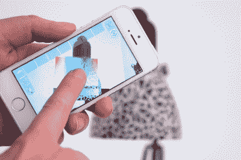

# 开放式混合给你数字王国的旋钮和按钮

> 原文：<https://hackaday.com/2015/07/30/open-hybrid-gives-you-the-knobs-and-buttons-to-your-digital-kingdom/>

随着使用新电器技术带来的一系列复杂性，人们很容易开始抱怨每次想打开厨房灯时都必须拿出手机。[Valentin]意识到我们的新界面并没有让我们的生活变得更简单，他和麻省理工学院媒体实验室的人已经开发了一个解决方案。

 [开放式混合](http://openhybrid.org/)将界面从手机 app 中取出，直接叠加到现实生活中我们想要操作的物品上。通过平板电脑或智能移动设备的镜头可以看到开放式混合接口。在实时视频流中，一组交互式旋钮和按钮叠加在它们控制的对象上。在一个例子中，将平板电脑举到灯下会显示用于颜色控制的调色板。在另一个项目中，叠加在 Mindstorms 坦克驱动玩具上的滑块成为驱动车辆在地板上行驶的控制面板。对象行为甚至可以捆绑在一起，以便将一个动作应用于一个对象，如关闭一盏灯，将应用于其他对象，在这种情况下，关闭所有其他灯。

在表面之下，Open Hybrid 基于[Open framework](http://www.openframeworks.cc/)开发，硬件接口由运行定制固件的 Arduino Yún 处理。不过，创建一个新的应用程序已经简化到可以用网络友好的语言(HTML、Javascript 和 CSS)来实现。最终结果是，他们的工具链减少了开发新控制面板对大量图形知识的需求。

如果您能抽出几分钟时间，请在硬盘上查看[Valentin 的] [SolidCon talk](https://vimeo.com/134679257) 设计新的数字接口，这些接口与我们已经使用了数百年的接口相呼应。

最后但同样重要的是，Open Hybrid 可能已经在实验室中诞生，但它的发展取决于社区，因为整个项目既是平台独立的，又是开源的。

当然，它没有[小胡子](http://hackaday.com/2015/03/25/mustache-mayhem/)，但它绝对更人性化。

[https://player.vimeo.com/video/133196130](https://player.vimeo.com/video/133196130)