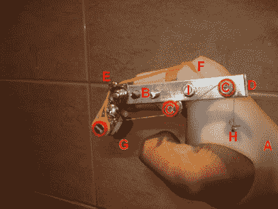

# 开源手指假体

> 原文：<https://hackaday.com/2012/10/18/open-source-finger-prosthesis/>

这里有一个项目正在努力开发一套开源的手指假肢。他们的目标是部分截肢的病人。这意味着手指的一部分保留了下来，可以用作设计良好的机械假体背后的动力，就像你在上面看到的那样。它使用杠杆、滑轮和电线来移动手爪，其工作方式与手指垫的工作方式非常相似。甚至有一个视频(在跳跃后嵌入)显示它被用来从自动售货机中抓取牙签…相当令人印象深刻。这类似于我们在 8 月份看到的[假肢](http://hackaday.com/2012/08/31/replacing-a-finger-or-an-arm-in-the-hacker-tradition/)，它设法在没有滑轮和钢丝的情况下工作。

这不仅限于手指。展示上面看到的装置的同一个帖子还包括一个假拇指。这种设计的杠杆作用是由一根编织的尼龙带提供的，尼龙带连接到手腕上的手镯上。

[https://www.youtube.com/embed/PkmHfT_rDf8?version=3&rel=1&showsearch=0&showinfo=1&iv_load_policy=1&fs=1&hl=en-US&autohide=2&wmode=transparent](https://www.youtube.com/embed/PkmHfT_rDf8?version=3&rel=1&showsearch=0&showinfo=1&iv_load_policy=1&fs=1&hl=en-US&autohide=2&wmode=transparent)

[谢谢迈克尔]