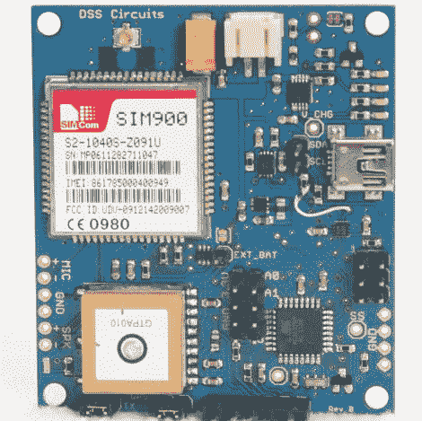

# 开源追踪系统获得 Kickstarter

> 原文：<https://hackaday.com/2012/04/02/open-source-tracking-system-gets-a-kickstarter/>

这里介绍的许多黑客技术激励其他人在创作者的工作基础上进行开发，有时积极的反馈会将这些技术推向市场。去年我们告诉过你【韦恩】的创造，[一个旨在追踪潜在游戏机窃贼的系统。](http://hackaday.com/2011/09/30/fake-ps3-tracks-thieves-all-the-way-home/)他收到了一堆完整记录追踪器的请求，所以他决定修改他的创作并作为开源硬件发布。

你可能还记得，他最初的跟踪设备是由 Arduino 驱动的，它监控加速度计和 GPS 传感器，根据需要向他的手机报告坐标和运动。他将不同的组件组合在一块板上，并为这个项目启动了 Kickstarter。

除了追踪被盗物品的最初目的，他还列举了一系列其他用途，比如追踪你刚拿到驾照的青少年的驾驶习惯，在特定区域设置地理围栏等等。

如果你对短信控制的一体化追踪系统感兴趣，可以看看他的 Kickstarter，或者看看文档，自己做一个。