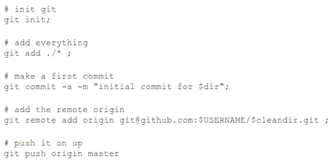

# 开源一切…有一个应用程序

> 原文：<https://hackaday.com/2012/04/12/open-sourcing-everything-theres-an-app-for-that/>

如果你是一个多产的开发者，并决定从你的工作中释放所有的源代码，会发生什么？好吧，你应该得到所有感兴趣的人的大力支持。因此，我们要感谢[亨特·戴维斯]发布了他的 70 多个 Android 应用程序的源代码。但是仅仅做出决定并不是事情的结束，你实际上已经得到了代码。黑客就在这里。他写了一个脚本来自动抓取、初始化和推送他的项目到 Github，而不是存档和发布所有的项目。

由于 Github API，这个过程变得非常简单。看起来他在他的脚本中使用了版本 2，但是如果你想写自己的脚本，你应该看看版本 3。他的脚本将 API 键和用户名作为命令行参数，然后遍历他的本地源代码树。在这个过程中，它使用一些文本操作来整理目录，以用作存储库的名称。一旦建立起来，它就进入目录，创建一个存储库，添加并提交所有文件，然后将它们推送到 Github。

以[Hunter]为例，分享你的代码真的很容易。我们希望更多的人会效仿，把他们的工作放在那里，供其他人学习和借鉴。

我们也看到了一些来自[Hunter]的硬件攻击。他做了一些与 ZipIt 相关的工作，也做了一些与 T2 和一个 Dockstar 一起玩游戏的工作。

[via [Reddit](http://www.reddit.com/r/Android/comments/s56lp/i_opensourced_68_android_applications_today_bsd)