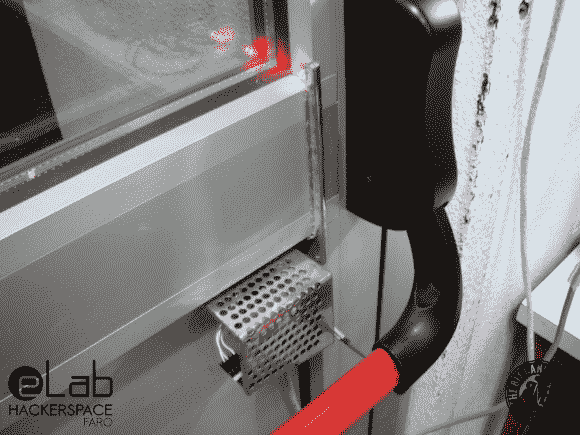

# 打个电话，打开你的黑客空间之门

> 原文：<https://hackaday.com/2013/12/12/open-your-hackerspace-door-with-a-phone-call/>

[马里尼奥]给我们发了一个小贴士，详细介绍了他和他的朋友为葡萄牙法鲁的 [eLab 黑客空间](http://elabualg.wordpress.com/)建造的[门禁系统。该空间位于阿尔加维大学的工程学院，这意味着该小组无法准确地在校园财产中钻孔，需要一个聪明的解决方案来为成员提供 24/7 访问。](http://www.thebitbangtheory.com/2013/11/elab-hackerspace-gsm-access-control-system/)

[马里尼奥]很快排除了更先进的蓝牙或 NFC 选项，因为他不想遗漏没有智能手机的成员。相反，在翻遍了一些垃圾箱后，该团伙决定入侵一部旧的西门子 C55 手机，作为 GSM 调制解调器，接收成员的电话。然后，传入的数字与相连的 PIC16F88 微控制器的 EEPROM 上的列表进行比较，该微控制器指示从烟草自动售货机回收的电机打开前门的推杆。他们必须设置电机，以类似活塞的运动方式移动手臂，从而提供正确的杠杆作用来解锁和重置杆的位置。

查看[马里尼奥的]博客，了解更多关于他们如何上传呼叫者日志到谷歌电子表格的细节和信息，并留下来观看下面的快速视频演示。如果你更喜欢一步一步的构建指南，请前往[随附的说明页](http://www.instructables.com/id/eLab-Hackerspace-GSM-Access-Control-System/)。如果你试图用 Arduino GSM shield 复制这种黑客攻击[，就要小心了。](http://hackaday.com/2013/09/24/safety-warning-arduino-gsm-shield-may-cause-fires/)

[https://www.youtube.com/embed/yVr2Pv74GmA?version=3&rel=1&showsearch=0&showinfo=1&iv_load_policy=1&fs=1&hl=en-US&autohide=2&wmode=transparent](https://www.youtube.com/embed/yVr2Pv74GmA?version=3&rel=1&showsearch=0&showinfo=1&iv_load_policy=1&fs=1&hl=en-US&autohide=2&wmode=transparent)