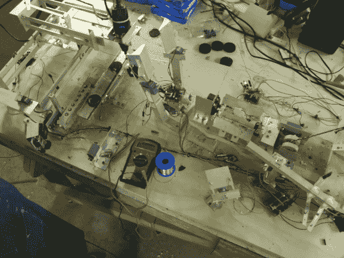

# 奥利奥-奶油仇恨者建造 Rube Goldberg CNC 路由器来移除填充物

> 原文：<https://hackaday.com/2013/03/01/oreo-creme-hater-builds-rube-goldberg-cnc-router-to-remove-the-stuf/>

听着，我们理解你需要找个项目来占据你的时间和兴趣。所以我们不会问错误的问题(为什么？)为了这一个。这家伙讨厌把巧克力饼干和奥利奥联系在一起的奶油。因此，他建立了一个复杂的系统来分离饼干和去除奶油。休息之后，请观看视频，了解硬件概述(我们可以瞥见 Arduino RBBB)和完整的演示。

虽然这个项目是公司的一个营销噱头，但我们真的很喜欢他们制作视频的乐趣，而且这个设备真的很好用！把一块饼干丢进滑槽，它就会被提升到用斧头劈开的位置(我们不确定斧头上的绳子是干什么用的)。然后，这两块饼干被一些伺服驱动的夹子抓住，并转移到 CNC 路由器床上，在那里 Dremel 工具在将饼干倾倒到你的手中之前去除残余的奶油。

再次强调，营销人员应该注意这种广告风格。请注意这里实现的两个主要特征:包括我们真正感兴趣的产品，并且不让人讨厌(我们正面看着你)。

[https://www.youtube.com/embed/pii4G8FkCA4?version=3&rel=1&showsearch=0&showinfo=1&iv_load_policy=1&fs=1&hl=en-US&autohide=2&wmode=transparent](https://www.youtube.com/embed/pii4G8FkCA4?version=3&rel=1&showsearch=0&showinfo=1&iv_load_policy=1&fs=1&hl=en-US&autohide=2&wmode=transparent)

[via [Reddit](http://www.reddit.com/r/arduino/comments/19c5st/guy_makes_extremely_overcomplicated_machine_to/)