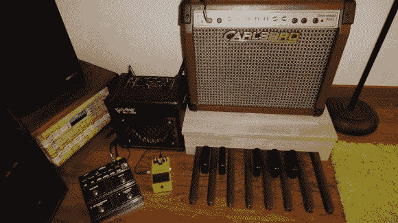

# 当你的贝斯手不见了的时候，风琴踏板会填补

> 原文：<https://hackaday.com/2012/12/18/organ-pedals-fill-in-when-youre-bass-player-is-missing/>

由于他的弦乐贝斯手不经常在身边，他用旧风琴的踏板制作了自己的电贝司替身。这个项目——他称之为器官捐赠者——受到了[一个类似的独立器官踏板低音项目](http://hackaday.com/2012/09/24/bacemaker-weds-organ-foot-pedals-with-guitar-whammy-effects/)的启发。那个仪器是用 555 定时器来产生声音的。但是[Antoine]有更大的发展空间，因为他正在使用一个旧的微控制器开发板来产生声音。

价值八度的踏板是从一个旧的坏掉的雅马哈 A55 电子琴上拉下来的。从仪器中取出组件后，他在它周围建了一个漂亮的木箱。这也是广播声音的放大器的支架。一个旧的飞思卡尔开发板连接了十二个键(最上面的 C 没有用)。它为每个键产生适当频率的方波。该信号通过一个低通滤波器，然后传送到机箱背面的音频插孔。

未来的改进包括在踏板总成中内置一个放大器。我们也希望看到不同的信号处理来扩大踏板可以产生的声音范围。我们不确定该微控制器的能力，但使用存储的样本来听到[音调生成会很不错。](http://hackaday.com/2012/11/02/atmega1284-as-an-8-voice-32-khz-synthesizer/)