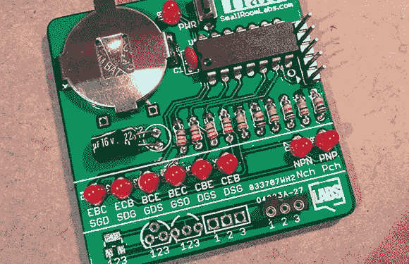

# 组织晶体管

> 原文：<https://hackaday.com/2013/09/14/organizing-transistors/>

去年年底，[matseng]为自己设立了一个有趣的挑战:每周设计一个新的 PCB，送到工厂，并建立一个新项目。这是一个艰苦的努力，但其中一些项目实际上非常有用和酷。迄今为止最好的一款[是 TraId](http://dangerousprototypes.com/forum/viewtopic.php?f=56&t=5857#p54310)——一款通过漂亮的 LED 接口识别晶体管类型和引脚排列的电路板。

这种构建的部分灵感来自危险原型的部分忍者，这是一种决定晶体管、电阻、电容和二极管引脚和数值的电路板。TraId 是一个更精简的版本，仅适用于晶体管，在一组 8 个 led 上显示引脚的方向和晶体管的类型。

虽然这种设计非常稀疏，但我们可以想象这种东西在黑客空间、实验室或任何混乱的小精灵来重组零件抽屉的地方非常有用。如果你想自己构建，所有需要的文件[都在 gits](https://github.com/SmallRoomLabs/TraId) 上。