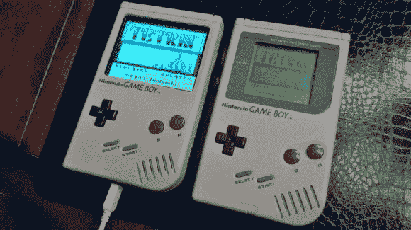

# 最初的 Gameboy 充满了酷的部分

> 原文：<https://hackaday.com/2014/07/27/original-gameboy-gets-stuffed-full-of-cool-parts/>

有一天在 Good Will，[microbyter]偶然发现了一款原厂 Gameboy，售价 5 美元。谁读了这篇文章不会接受这样的交易呢？[microbyter]回到家发现这个复古便携不起作用的时候有点失望。他试图恢复它，但这是一个失败的事业。为了把柠檬变成柠檬水，Gameboy 被掏空，重建成一个相当惊人的项目。

看改装和未改装的单元，极其明显的是有新的液晶屏。它的对角线尺寸为 3.5 英寸，比原屏幕的 2.6 英寸大得多。此外，它可以显示不同于单色原件的颜色。翻转该单元将显示一对夫妇的按钮已被添加到电池舱门上，作为肩按钮。

该项目的大脑是一个运行 [Retropie](http://blog.petrockblock.com/retropie/) 视频游戏系统模拟软件的 Raspberry Pi，该软件将模拟一系列游戏机，包括最初的 Gameboy。视频通过复合视频输出发送到液晶屏。Pi 的耳机插孔连接到一个小型音频放大器，为仍然位于库存位置的原始扬声器供电。由于原来的电路板被移除，连接控制器按钮变得有点复杂。幸运的是，有一种[替代板](http://store.kitsch-bent.com/product/common-ground-dmg-button-pcb)可用于这种类型的项目，它可以固定在库存位置，允许使用原始的图标按钮，并具有容易接近的焊点。该板连接到 Pi 的 GPIO 引脚。

由于所有上述设备都被塞进了 Gameboy 外壳，因此没有足够的空间来放置电池。原来的耳机插孔被移除，并替换为用于连接外部电池组的微型 USB 端口。

[https://www.youtube.com/embed/-g9DfTQgusE?version=3&rel=1&showsearch=0&showinfo=1&iv_load_policy=1&fs=1&hl=en-US&autohide=2&wmode=transparent](https://www.youtube.com/embed/-g9DfTQgusE?version=3&rel=1&showsearch=0&showinfo=1&iv_load_policy=1&fs=1&hl=en-US&autohide=2&wmode=transparent)

谢谢[约翰]