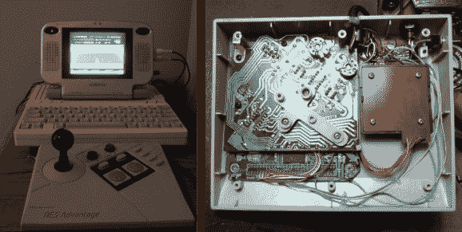

# 原 NES 优势控制器塞满了克隆 NES

> 原文：<https://hackaday.com/2013/11/16/original-nes-advantage-controller-stuffed-with-clone-nes/>

像所有优秀的黑客一样,[Osgeld]定期出现在旧货店寻找原材料。今年夏天，他非常幸运地发现了几款 NES 克隆游戏。这些控制器通过使用复合视频连接到电视来模拟最初的任天堂娱乐系统。控制器的机械结构已经相当糟糕了，但是他知道他可以用里面的电路板做些什么。不管怎么说，这是一次每人一美元的小赌博。

正如你在上面看到的，[他升级了一个老式的 NES 优势控制器](http://www.instructables.com/id/Project-Advantage-Install-a-famiclone-into-a-NES-A)，在里面装满了仿真器硬件。首先，他拆卸了拱廊式的外围设备，对所有的东西进行了彻底的清洗。因为他无论如何都要焊接到 PCB 上，所以他升级了控制器，把原来的开关换成了一套不同的触摸开关。大的底座为[Osgeld]提供了足够的空间来安装模拟器(包括 rom ),现在他正在*玩弄权力。*

NES 优势是一个非常怀旧的控制器。连[捉鬼敢死队都黑上了](http://www.youtube.com/watch?v=P6NhfRFSaFo&t=1m1s)！