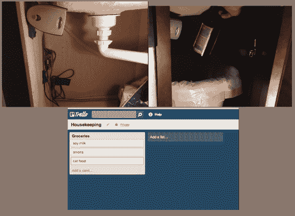

# 奥斯卡从垃圾桶里更新你的购物清单

> 原文：<https://hackaday.com/2013/11/23/oscar-updates-your-grocery-list-from-the-trash/>

[丹]想出了一个新颖的方法来解决这个古老的问题:保持你的购物清单更新。他在厨房橱柜下加了一个条形码扫描仪和一个树莓派。他称这个系统为“奥斯卡”，尽管我们在他的垃圾桶里没有看到任何抱怨。当[丹]用完一种产品时，他就把它扔掉。就在他的垃圾和回收箱上方是一个低成本的条形码扫描仪。[丹]拿着这个东西，直到扫描仪读取，然后把它送去回收或填埋。解码后的条形码由藏在橱柜下的树莓皮处理。Raspberry Pi 使用 Trello api 将数据发送到 Trello.com 的。

如果 trello 的数据库没有识别出某个产品，Trello 就会向[Dan 的]手机发送一条短信。然后，他可以通过 web 界面添加产品信息。我们认为用户界面是最棒的。一旦产品进入数据库，每天唯一要做的事情就是在扔掉一个包之前暂停一会儿。[丹]在 github 上发布了他所有的[代码，还为奥斯卡创建了一个](https://github.com/danslimmon/oscar)[Reddit 线程](http://www.reddit.com/r/raspberry_pi/comments/1qwh4w/using_a_raspberry_pi_to_autoadd_things_to_my/)。

http://www.youtube.com/watch?v=9_MNOOgFDg4

[途经 reddit.com]