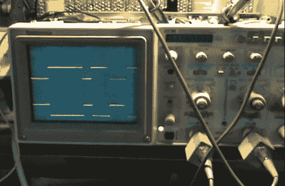

# 示波器 VFD 维修就像给自己做脑外科手术

> 原文：<https://hackaday.com/2012/10/09/oscilloscope-vfd-repair-like-doing-brain-surgery-on-yourself/>

[Jerry Pommer]有一台旧的 Tektronix 2236 出现了一些问题。屏幕右上角是一个 VFD 显示屏，用于显示各种数值测量结果。不幸的是，这已经停止工作，所以[他让示波器探头本身，以便解决问题](http://www.jerrypommer.com/tektronix-2236-repair/)的情况。

整个修复过程被拍摄下来，你可以看到休息后嵌入的 42 分钟的工作。示波器里塞满了很多东西，我们在视频的开头看到了一个完整的演示。一旦[Jerry]开始工作，他就追踪问题到一个 JK 触发器，该触发器用于给显示器供电。起初，输出看起来是正确的，但是时钟信号没有按预期工作。他的解决方案是使用 MSP430 芯片来代替触发器功能。

尝试这种修复的信心是由[托德·哈灵顿的] [汽车立体声 VFD 修复视频](http://hackaday.com/2012/09/24/repairing-a-vfd-driver-on-a-car-stereo/)激发的。

[https://www.youtube.com/embed/kn5QThBe9oQ?version=3&rel=1&showsearch=0&showinfo=1&iv_load_policy=1&fs=1&hl=en-US&autohide=2&wmode=transparent](https://www.youtube.com/embed/kn5QThBe9oQ?version=3&rel=1&showsearch=0&showinfo=1&iv_load_policy=1&fs=1&hl=en-US&autohide=2&wmode=transparent)