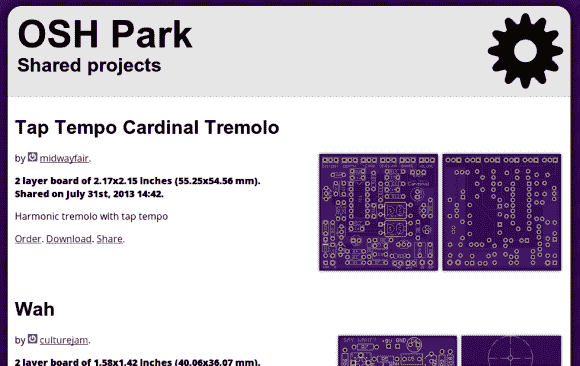

# 奥什公园增加董事会共享功能

> 原文：<https://hackaday.com/2013/07/31/osh-park-adds-board-sharing-feature/>

奥什公园继续变得越来越好。我们认为[最近增加的项目共享](http://oshpark.com/shared_projects)是一个巨大的特性！显然，这让你可以用最少的努力订购他人发布的开源软件。但是对我们来说，还有一些其他的东西让它变得有价值。

首先，浏览项目的能力会给你自己的工作带来巨大的灵感。其次，board 文件本身是可以下载的，看起来你可以在共享你的项目时发布到你的库的链接，如果你愿意的话。这使得奥什公园成为多氯联苯的聚集地。浏览所提供的内容，然后下载文件进行自我蚀刻，或者只是作为参考，看看其他人在布置痕迹时是如何做的。当然，提供的最低价格使这对于共享分线板设计来说是显而易见的。

Twitter 帖子称这是该功能的“早期阶段”。我们迫不及待地想看到随着它的成熟，他们会想出什么。