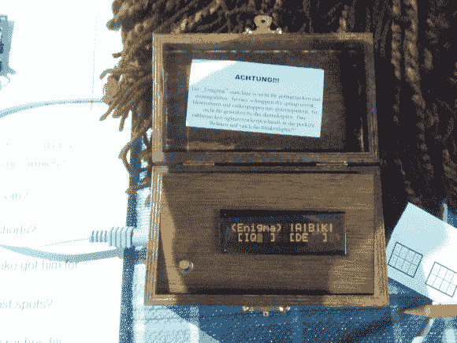
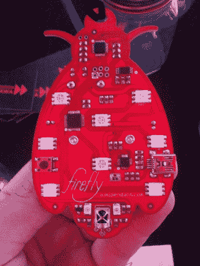
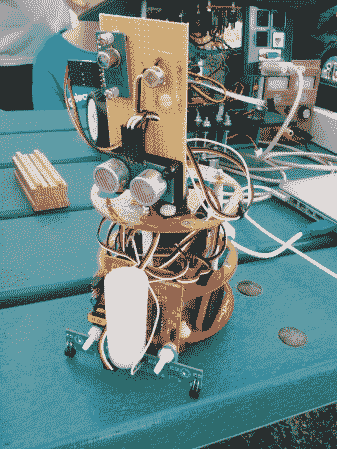

# 渥太华迷你创客节

> 原文：<https://hackaday.com/2013/09/01/ottawa-mini-maker-faire/>

渥太华迷你创客节于上周末在加拿大科技博物馆举行。我在镇上，决定去看看。休息之后，看看我在集会上看到的一些项目。

This pinball machine will be controlled by a Raspberry Pi

我们最近推出了一款 [Raspberry Pi 驱动的弹球机](http://hackaday.com/2013/08/19/building-a-pinball-out-of-its-playfield/ "Building an entire pinball machine from just the playfield")，这是另一个使用 Pi 振兴弹球机的项目。[艾伦]、[迈克]和[兰迪]正在构建 [DIY 弹球系统](http://diypinball.ca "DIYPinball")，使用定制的印刷电路板控制灯和螺线管。它在 36 伏电压下工作，这是用足够的功率点燃螺线管所需要的。该系统通过 CAN 网络连接，并由 Raspberry Pi 管理。

The Creepy Eyeball tracked faces of people passing by

这个令人毛骨悚然的眼球使用一个 USB 接口来控制摇摄、倾斜和虹膜控制的伺服系统。它使用 OpenCV、网络摄像头和 Python 脚本来跟踪路过的人的脸。一旦它锁定了一个目标，虹膜就会张开，盯着你。

This box simulated the Enigma Machine

一组展示了他们基于 PIC 微控制器的[英格玛机](http://en.wikipedia.org/wiki/Enigma_machine "Enigma Machine")模拟器。他们给与会者上了一堂关于“谜”是如何工作的历史课，然后让他们通过在 PS2 键盘上键入密码来测试他们的模拟器。如果转子、反射器和插板设置正确，你就能破译他们的密码。

The Lumipendant Firefly badge

Lumipendant Firefly 是为 Nuit Blanche 设计的发光徽章。它通过红外与附近的萤火虫交流，并可以安排活动，让附近所有徽章上的 LED 图案闪烁。它基于 Arduino，该组织计划在 Nuit Blanche 之后将其用于教育目的。显然有人要把它变成一个电视。

The 555 Music Box used a paper tape to play songs

史蒂文的音乐盒使用了一个 555 定时合成器，通过电阻来调整每个音符。当纸轮转动时，铜触点连接到适当的电阻 555 来播放音符。[Steven]还制作了一个关于这个项目的[视频](http://www.youtube.com/watch?v=WM1bZgBqDl4)。

This robot was designed to compete in the Fire Fighting Home Robot Compeition

渥太华机器人爱好者展出了一批机器人。这是为[消防家用机器人竞赛](http://www.trincoll.edu/events/robot/ "Fire Fighting Home Robot Competition")建造的。比赛要求机器人在房间里找到一支蜡烛并熄灭它。这个机器人使用一个 [UVTRON](http://www.acroname.com/robotics/parts/R67-UVTRON.html "UVTRON") 传感器来发现蜡烛发出的紫外光，并用蜡烛将其熄灭。

感谢每一个来到展会，花时间谈论他们的项目的人。如果你想认识你所在地区的创客，看看你是否有当地的小型创客集会。