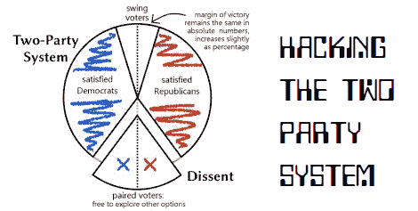

# 我们第一个不涉及电子选票的选举黑客

> 原文：<https://hackaday.com/2012/10/15/our-first-election-hack-that-doesnt-involve-e-ballots/>

因为 Hackaday 的一些读者不是来自美国，所以让我们从投票者的角度来告诉你美国的选举过程。在接下来的几周里，政治活动将在全国范围内投入数百万美元用于广告、动员投票和拉票活动。在 11 月 6 日之前，电视广播将会播放更多的广告和政治分析，届时选民将会前往投票站，为在 7 月赢得选票的人投票。

尽管公众舆论可以被有效地左右，但美国的选举过程仍然存在许多问题。得票最多者当选，赢家通吃制度保证选民只会有两种现实的选择，但一群哲学学生(和老师)可能有解决这个问题的办法。

实际上，这个想法相当简单:让一个政党的不满成员与另一个政党的不满成员进行匹配。通常情况下，这些选民会倾向于投票给政党，而不是他们的良心，因为害怕丢掉他们的选票。将这些选民配对后，他们彼此达成君子协定(要么握手，要么一起邮寄选票),不投票给政党。民主党和共和党之间的权力平衡依然存在，但第三方候选人得到了急需的一针强心剂。

这是一个有趣的想法，比选举后涌现的无数电子投票黑客更有可能带来一些变化。当然，它可能不如其他投票系统有效，如[孔多塞法](http://en.wikipedia.org/wiki/Condorcet_method)，但除了当选官员放弃授予他们的权力，这可能是我们得到的最好机会。