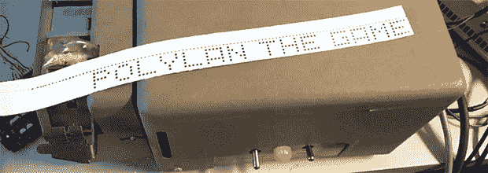
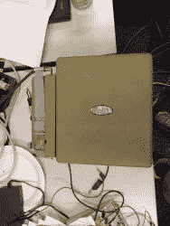
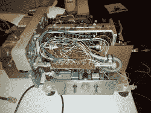
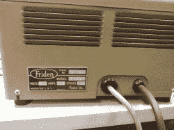
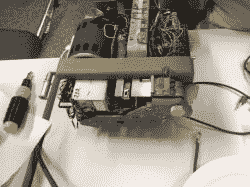
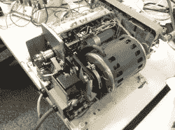
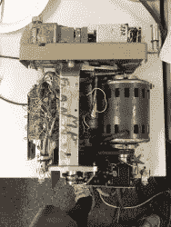
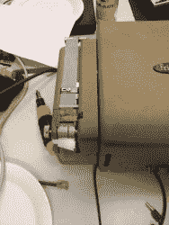

# 在纸带机上输出文本

> 原文：<https://hackaday.com/2013/06/22/outputting-text-on-a-paper-tape-machine/>

在 8 英寸软盘出现之前，存储计算机程序甚至比一堆穿孔卡片还要原始得多。最早的通用计算机使用纸带，纸带上打孔表示 0 或 1。谢天谢地，对于当时的计算机科学家来说，这些纸带不是手工制作的。不，Friden SP-2 纸带穿孔机负责在这些纸带上打孔。当[Max]从一个垃圾桶里抢救出一台磁带打孔机时，他知道他需要做什么:[将它连接到 Arduino](http://vimeo.com/68848138) 上，这样他就可以创建自己的纸带。

[Max]发现了一个 veroboard，里面有一堆晶体管，是以前的所有者添加的。在找到机器的手册后，他将机器连接到 Arduino 上，将八个控制销中的每一个都保持在高位以打孔，然后将另一个销保持在高位以推进胶带。有了这个，他就能在纸带上打出字母而不是二进制代码。

[Max]还为他的 Arduino 添加了一个以太网屏蔽，用于检查他的电子邮件。如果一封电子邮件出现在一个特殊的文件夹中，它会将主题行输出到磁带打孔机，给他一个完全复古的收报机，用老式的 60 年代硬件建造。

下面有一对[Max]的磁带打孔机的视频，以及这个不可思议的机器的迷人镜头。

[https://player.vimeo.com/video/68861222](https://player.vimeo.com/video/68861222)[https://player.vimeo.com/video/68848138](https://player.vimeo.com/video/68848138)