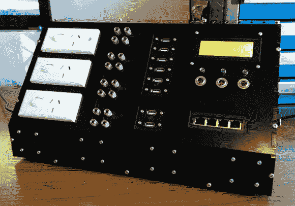

# 过度设计 USB 集线器

> 原文：<https://hackaday.com/2014/04/25/overengineering-a-usb-hub/>

我敢肯定，像我们许多人一样，[Nick]不喜欢在他的计算机机箱后面挖来挖去找一个备用的 USB 端口，最终为他的桌子买了一个小 USB 集线器。集线器工作得很好，但是[Nick]意识到增加一个以太网端口是个不错的选择。和 DC 电源。然后特征蠕变开始。

[Nick]最终建造的是一个巨大的桌面集线器,在香蕉插头上有两个 24V、5V、3.3V 50 瓦 DC 输出，一个五端口 USB 集线器，四端口以太网开关，三个电源插座，32 个数字 I/o、UART、SPI 和 I2C 端口，一个 24×4 LCD 或显示 DC 电流使用和串行输入，冷却风扇，以及一个蜂鸣器。

外壳由 6mm 的激光切割丙烯酸树脂制成，电子设备不可否认有点乱。也就是说，这个盒子*看起来非常有用，甚至可以播放来自*马里奥兄弟*的主题，如下面的视频所示。*

 *[https://www.youtube.com/embed/YkR7Cn8UQNE?version=3&rel=1&showsearch=0&showinfo=1&iv_load_policy=1&fs=1&hl=en-US&autohide=2&wmode=transparent](https://www.youtube.com/embed/YkR7Cn8UQNE?version=3&rel=1&showsearch=0&showinfo=1&iv_load_policy=1&fs=1&hl=en-US&autohide=2&wmode=transparent)*