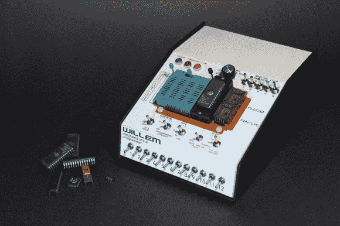

# 检修集成电路编程器

> 原文：<https://hackaday.com/2014/01/06/overhauling-an-ic-programmer/>

[NeXT]需要一个 EPROM 程序员来处理老式计算机的芯片。从一个低成本程序员开始，他建造了这个[定制 IC 程序员](http://www.vintage-computer.com/vcforum/entry.php?441-Overhauling-the-Lowly-Willen-Programmer)来处理他所有的编程需求。

该设备基于 Willem 5.0e 编程器。[NeXT]对该设备不满意，指出它在使用过程中必须小心地与金属表面隔离，并且需要设置许多烦人的跳线。

为了解决这些问题，他从拆除编程器开始。IC 插座被移到子板上，子板可以干净地安装到金属外壳中。更换跳线有点复杂，选择了拨动和旋转开关的组合，使更改设置更容易。

将电路板焊接在一起看起来不是一件容易的事情，需要 200 个焊点来连接插座和开关。在调试了一些短路和死连接后，[NeXT]设法在圣诞节截止日期前完成了这个 1.5 年的项目。