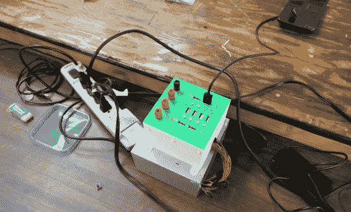

# 过度使用手机充电器，因为，为什么不呢？

> 原文：<https://hackaday.com/2014/05/27/overkill-phone-charger-because-well-why-not/>

在补锅匠的生活中，有能力插入和驱动许多 USB 设备是很方便的。当然，您可以使用 USB 集线器，但如果您的设备需要大量电流，这可能不会令人满意。一台计算机可能工作，但不是真正的独立解决方案。

[杰夫]在 Make Lehigh Valley 的工作人员遇到了这种困境。他们正在进行一个 Adafruit 小饰品课程，需要一个 USB 电源为所有将要使用的小饰品供电。正如任何创客空间都会做的那样，他们建造了自己的 [USB 发电站](http://makelehighvalley.com/blog/2014/05/hackers-phone-charger/)，最终产品对于他们所需要的来说肯定是多余的(这不是一件坏事)。

一个旧的 ATX 电脑电源是一个合理的组成部分，用于这种类型的项目。这些电源通常供应充足，可以提供任何合理数量的 5v USB 设备所需的所有安培数。来自 ATX 电源的 5v 输出被连线到 8 个 USB 插孔。为了保持项目的灵活性，这些 USB 插孔是从几个旧的 PCI 插槽 USB 集线器面板中清理出来的。不满足于只有 USB 输出，这些家伙还连接了一些香蕉插孔，以便 3.3、5 和 12 伏电压可用于任何正在进行的项目。3D 打印外壳让一切保持整洁。

这个项目使用了一堆回收的零件，解决了小组面临的一个问题。如果你有兴趣使用 ATX 电源来制作一个更加台式的电源，那么看看这个版本。