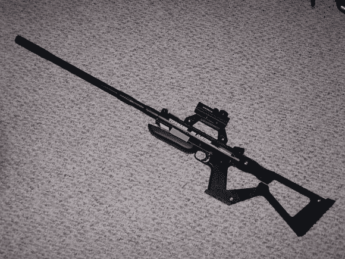

# 彩弹手枪变成狙击步枪

> 原文：<https://hackaday.com/2014/01/07/paintball-pistol-turned-sniper-rifle/>

彩弹手枪和彩弹狙击步枪之间有巨大的价格差异。所以[3D 打印版]决定为自己打印一套狙击手升级套件。

他从经典的 Tippman 98 定制手枪开始，这是一种久经考验的可靠的彩弹枪行业标准。利用 Sketchup，他设计了一个侧装料斗适配器、一个固定的枪托、一个弹匣适配器、各种支架，甚至还有一个两脚架前把手。然后，他在当地的黑客空间打印出零件；位于宾夕法尼亚州东北部的 Innovatrix 实验室。Portabee 3D 打印机用于一些第一批原型，但最终的零件都是在一个大型修理工 x2 上打印的，其建造面积足以容纳整个固定库存！

最精彩的部分？他用 SketchUp 才几个月。一旦设计和构建完全完成，他可能会在 CC 许可下发布它。

这只是表明 3D 打印机真的正在打破各种价格过高的塑料组件市场——3D 打印机只打印小饰品？Pfft。

[Via [Reddit](http://www.reddit.com/r/3Dprinting/comments/1ueofm/i_taught_myself_sketchup_and_modded_my_paintball/)