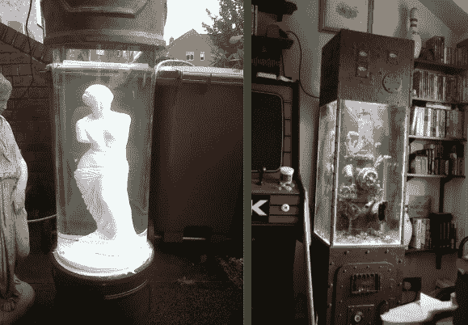

# 一对水族馆的建造里里外外都是杰作

> 原文：<https://hackaday.com/2013/07/31/pair-of-aquarium-builds-are-masterpieces-inside-and-out/>

当你开始了解建造这两个水族馆所涉及的一切时，你会感到震惊。在我写这篇文章的时候，论坛的帖子有 56 页长，里面充满了大童粉丝的崇拜。他做了如此多的工作，以至于每一页都贴满了进度图，涵盖了各种主题:管道、电气、机械、艺术…哇！

这个~~诅咒~~项目是由一个朋友送给他几个巨大的丙烯酸圆柱体引发的，这些圆柱体对于定制水族馆来说是完美的尺寸。[童]甚至有一些水下艺术品的想法来填充它们。一个是雕像废墟的复制品，让你觉得坦克是亚特兰蒂斯的一部分，供你娱乐。另一个是管道烟囱的迷人复制品。你知道，那些用来运走废物的大型铸铁管？但这些实际上是带有粘土口音的 PVC 部件。它们被打碎、切割、融化、打磨，谁知道还有什么，才形成了这个样子。不同的水族馆有不同的照明技术。有定制的过滤挡板。我们可以继续下去，但我们不会因此检查所有细节顶部的链接。

最后，他超越了最初的圆柱体，为管道设计建造了自己的方形容器。这是一个蒸汽朋克作品，所以甚至有模拟表盘来显示栖息地的重要标志。

只是想维护你已经拥有的坦克？[造一个自动化学分配器](http://hackaday.com/2011/08/14/automated-aquarium-chemical-dispenser-is-extremely-precise/)怎么样。