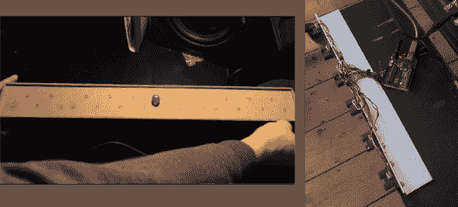

# 一对音乐黑客使用传感器阵列作为键盘

> 原文：<https://hackaday.com/2013/02/20/pair-of-musical-hacks-use-sensor-arrays-as-keyboards/>

这对音乐键盘黑客都使用光来检测输入。这两个提示出现在同一天，这在 Hackaday 引发了对一致性理论的讨论。天气一定会影响人们从事什么类型的项目，因为我们经常看到这样的趋势。两个项目的视频都是在跳转后嵌入的。

左边是[一个光敏键盘](http://vimeo.com/59142013)，【Kaziem】正在展示它。在这张图片中，他正在表面上滚动一个弹球。当它经过硫化镉传感器(排列在钢琴键盘的白键和黑键图案中)时，乐器根据变化的光线水平演奏音高。[感谢迈克尔通过[制作](http://blog.makezine.com/2013/02/18/lightefface-makes-music-with-both-touch-and-light/)

右边是【Lex 的】[接近传感器键盘](http://jnrhacksaw.tumblr.com/post/43488930384/raspberry-pi-with-puredata-arduino-and-sensor)。它使用了六个红外线接近传感器，这些传感器可以接收反射光。他称之为“量化特雷门琴”,在看到它的作用后，我们明白了为什么。超频的 Raspberry Pi 播放音调的反应会根据与键盘本身的距离以及手与不同传感器的对齐情况而有所不同。

[https://player.vimeo.com/video/59142013](https://player.vimeo.com/video/59142013)

[https://www.youtube.com/embed/kkTJ0tNl9dw?version=3&rel=1&showsearch=0&showinfo=1&iv_load_policy=1&fs=1&hl=en-US&autohide=2&wmode=transparent](https://www.youtube.com/embed/kkTJ0tNl9dw?version=3&rel=1&showsearch=0&showinfo=1&iv_load_policy=1&fs=1&hl=en-US&autohide=2&wmode=transparent)