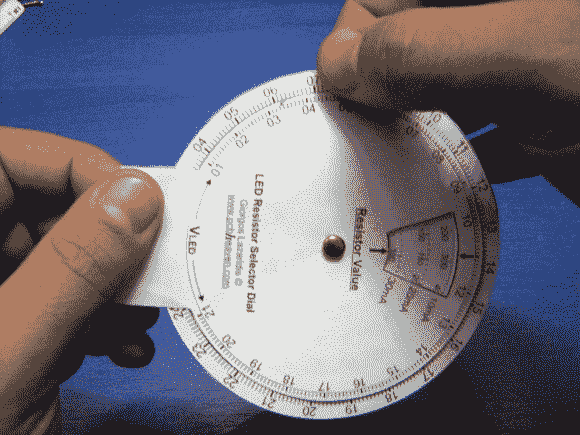

# Papercraft 刻度盘是限流电阻的滑动标尺

> 原文：<https://hackaday.com/2013/01/14/papercraft-dial-is-the-slide-ruler-of-current-limiting-resistors/>

这个[纸刻度盘使得选择限流电阻变得轻而易举](http://www.pcbheaven.com/userpages/led_resistor_dial)。[Giorgos Lazaridis]想出了这个工具，他在文章的工作日志选项卡中详细描述了这个工具。如果你想要一个自己的，他还贴了一个 PDF，你可以打印，剪切，钉在一起。

此时，我们可以在不查看参考资料的情况下计算 LED 电路的电阻值。但并不总是这样。对于那些刚刚开始爱好电子产品，试图掌握点亮一个简单项目背后的理论的人来说，这个轮子将是一个非常棒的工具。外侧车轮参考源电压，内侧车轮测量 LED 两端的正向电压。将这两个值对齐，您可以在右边的窗口中读取最佳电阻值。但是等等，还有呢！正如您在视频中看到的，在休息之后，表盘的另一面还包括一个窗口，它会告诉您功耗，以便您可以选择合适的额定电阻。滑头！

[https://www.youtube.com/embed/QmkXslIcHF0?version=3&rel=1&showsearch=0&showinfo=1&iv_load_policy=1&fs=1&hl=en-US&autohide=2&wmode=transparent](https://www.youtube.com/embed/QmkXslIcHF0?version=3&rel=1&showsearch=0&showinfo=1&iv_load_policy=1&fs=1&hl=en-US&autohide=2&wmode=transparent)