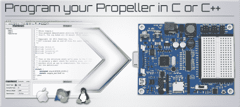

# 视差显示对开源的热爱:GCC + Propeller

> 原文：<https://hackaday.com/2012/06/20/parallax-shows-love-for-open-source-gcc-propeller/>

Parallax 做了一件大多数微控制器制造公司不可想象的事情。他们已经决定[支持基于 GCC](https://sites.google.com/site/propellergcc/home) 的开源工具链。没错，与其在示例代码使用残废软件的平台上努力编译代码，不如实际下载、编译并开始使用这个工具链，而没有代码大小限制或其他不利的限制。

为什么这很重要？我想到的一个例子是 [ChibiOS](http://chibios.org/dokuwiki/doku.php?id=start) 和 STM32F0-Discovery 板。我们最近[一直在玩那个板](http://hackaday.com/2012/06/17/template-for-building-stm32f0-discovery-project-in-gcc/)，发现[atoll IC 8k 代码大小限制阻止你调试 ChibiOS](http://forum.chibios.org/phpbb/viewtopic.php?f=3&t=333&start=20#p4354) 。所以你要么支付注册费，要么至少经历一点痛苦(很大程度上取决于你的技能水平)转向开源解决方案。这种情况不会发生，因为你从“Go”这个词开始使用 GCC 选项。

所以和我们一起为好的决策鼓掌吧。太棒了视差怪。此次测试的目标是 P8X32A 推进器芯片，但我们希望它如此受欢迎，以至于该系列的其他产品也能获得自己的支持。

[感谢 Devlin via [Adafruit](http://www.adafruit.com/blog/2012/06/19/parallax-releases-propeller-gcc-beta/)