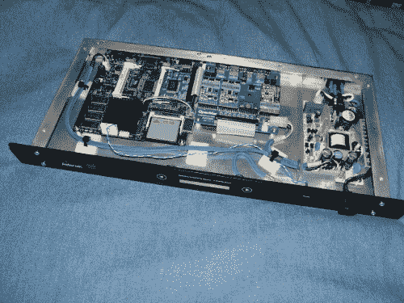

# 用于多分机家庭电话的 PBX 刀片

> 原文：<https://hackaday.com/2013/06/19/pbx-blade-for-multiple-extension-home-telephony/>

它看起来像是消费品，但这个 PBX 刀片服务器是由 Benoit Frigon 在过去几年里制造的。它为他的家庭服务带来了多种电话分机。

该设备运行 Asterisk 开源 PBX 软件。因为它会一直亮着他想要的那种不会消耗很多能量的东西。左边的 500 Mhz 系统只有半个 g 的内存。这足以完成工作，10 瓦的功率不会让你倾家荡产来支付电费。中间的板子是用来连接模拟手机和固定电话的。从表面上看，他已经安装了两个分机。

这在某种程度上是 PBX 钻机的课程，但外壳是他真正发光的地方。[Benoit]使用 22 号铝板制作外壳，旨在与他家的机架安装硬件融为一体。为了在机架上提供控制，他在基于 PIC 18F2520 的机箱前面添加了自己的 LCD 和触摸感应按钮接口。由于他编写的自定义界面，该系统还可以通过网络访问。