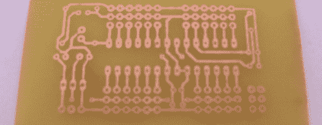

# PCB 制造教程

> 原文：<https://hackaday.com/2012/06/02/pcb-manufacturing-tutorial/>

在每个制造商的职业生涯中，总会有一段时间，无焊试验板不行了，perfboard 变得讨厌了，deadbug 也不可能了。解决办法是制造 PCB，但这需要一个学习过程。从[【Scott】的牛逼 DIY PCB 指南](http://provideyourown.com/2012/make-your-own-pcb-part1/)里学了几招，自己做印刷电路板就轻松了。

制作 PCB 有几个基本步骤。首先是在 Eagle 或 [KiCad](http://www.kicad.org/display/KICAD/KiCad+EDA+Software+Suite) 中设计电路板。下一步，将设计放入铜中，有许多技术可供选择。照片转印、直接印刷和数控铣削都有巨大的好处，但是到目前为止，业余爱好者生产电路板最常见的方式是使用[层压机](http://www.artemlive.com/cgi-bin/news?c=v&id=756)进行墨粉转印。

除非你只做 SMD 电路，否则需要钻孔。大多数人可以用 Dremel 或其他旋转工具逃脱，但 Hackaday 有一个[最喜欢的钻床](http://hackaday.com/2009/02/27/tools-proxxon-drill-press-tbm115tbm220/)，非常适合在 FR-4 上钻孔。在[Scott]的教程的第二部分中，他在进入过孔之前检查了阻焊膜和丝网。这些通过电路板导电的小铜片对于车库里的建筑商来说是极其困难的，但是有一些解决方案——铜铆钉(有人有美国的来源吗？)和铜箔都可以使用，但有时最有效的解决方案是用大量焊料和热量击打电路板。

感谢[【Upgrayd】](http://offkilterengineering.com/pcb-toner-transfer-experimentation/)的标题图。