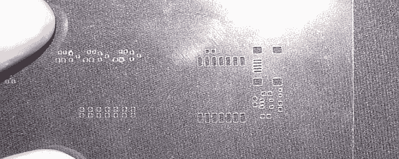

# 200 美元的印刷电路板模板

> 原文：<https://hackaday.com/2013/03/11/pcb-stencils-for-200/>

如果你在迈克尔斯工艺品店或业余爱好大厅逛得够久，会发现一些非常酷的东西。最近，[Ben]拿起了一个手工切割器——一个类似于乙烯基切割器的小装置，用于剪贴簿和其他巧妙的 endevours。他正在用这台机器制作焊膏模板，这比他以前用过的任何激光切割模板都要好。

[像我们之前见过的一个建筑](http://hackaday.com/2012/12/27/diy-smd-stencils-made-with-a-craft-cutter/),【本】正在使用一个桌面大小的乙烯基切割机， [Sihouette 肖像](http://www.silhouetteamerica.com/?page=shop&cat=2)，用 4 密耳聚酯薄膜。将 Gerber 文件的相关层转换为。SVG 文件，[本]加载了[机器人足球赛](http://gitorious.org/robocut)在他的焊接模板上切非常非常小的孔。成果很大；比激光切割聚酯薄膜好得多，至少可以在几百块板上粘贴。

当[Ben]用他的模版来涂焊锡膏时，我们想知道是否可以用类似的方法将紫外线固化的阻焊膜涂在家庭自制的电路板上。这将使得一些非常专业的电路板的生产周转时间只有几个小时。