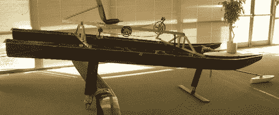

# 踏板动力水翼船看起来很有趣

> 原文：<https://hackaday.com/2012/04/27/pedal-powered-hydrofoil-looks-like-a-lot-of-fun/>

在阅读了我们几天前发布的一个以自行车为动力的水翼船后，[詹姆斯]提交了这个项目，这个项目为他赢得了加拿大新斯科舍省达尔豪西大学的一枚铁环。这是一艘由碳纤维和钛传动轴制成的[踏板驱动的水翼船](http://poisson.me.dal.ca/~dp_04_5/index.htm)詹姆斯和其他五名学生在 2005 年建造的机械工程高级设计班。

该团队称之为 Halifoil，它基于横卧设计，使用双碳纤维船体，使骑手在不踩踏板时保持在水面之外。碳纤维箔和钛传动轴的使用减轻了重量，因此骑手可以很容易地加速到船壳露出水面的速度。

与我们发布的上一个水翼艇相比，[詹姆斯]的体积要重得多，但它更适合坐在湖中，然后在水面上飞行时蹬向岸边。

尽管这个项目已经有几年的历史了，但它仍然是一个非常酷的版本。[詹姆斯]好心地把他的视频上传到 YouTube 上的达尔豪西服务器上；休息之后你可以去看看。

[https://www.youtube.com/embed/EJ6NwbaAU4w?version=3&rel=1&showsearch=0&showinfo=1&iv_load_policy=1&fs=1&hl=en-US&autohide=2&wmode=transparent](https://www.youtube.com/embed/EJ6NwbaAU4w?version=3&rel=1&showsearch=0&showinfo=1&iv_load_policy=1&fs=1&hl=en-US&autohide=2&wmode=transparent) [https://www.youtube.com/embed/Gckjfdinbp8?version=3&rel=1&showsearch=0&showinfo=1&iv_load_policy=1&fs=1&hl=en-US&autohide=2&wmode=transparent](https://www.youtube.com/embed/Gckjfdinbp8?version=3&rel=1&showsearch=0&showinfo=1&iv_load_policy=1&fs=1&hl=en-US&autohide=2&wmode=transparent)