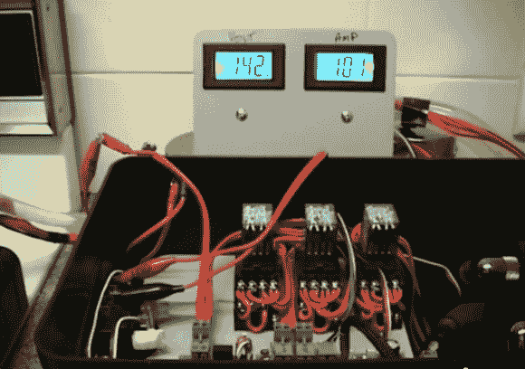

# 珀尔帖营火发电机熄灭 14W(种)

> 原文：<https://hackaday.com/2013/01/10/peltier-campfire-generator-put-out-14w-kind-of/>

这是[杰克]为他的营火发电机建造的控制和监控硬件。他能走到这一步已经很了不起了。您可以看到，他从系统中抽取了 1 安培 14.2 伏的电压。但是有一个问题仍然困扰着他。

该钻机使用一个大金属板作为篝火上方的散热器(由烹饪炉模拟进行测试)。在那块板的背面是一排珀耳帖冷却器，它们根据从一边到另一边的温差发电——这与蜡烛发电机的原理相同。冷端有一个散热器，有水流过。你在上面看到的是三个继电器，它们根据电压输出在串联或并联使用 Peltiers 之间切换。你不能真的在那里，但有一个散热器和循环泵的权利，这是用来冷却水。我们提到的问题是散热器跟不上火的热度。为了得到上面看到的结果，Jack 让冷水从水龙头流过散热器。但是如果在冬天使用，水可以通过一个装满雪的大盒子循环。继续铲进去，保持电势！

休息之后，我们嵌入了项目视频的第四部分，因为它很好地展示了珀尔帖冷却器阵列。您还会看到第五部分(散热器和循环泵测试)，这张图片就是从这里拍摄的。

第四部分–电炉测试

[https://www.youtube.com/embed/zjfrHgbSHaU?version=3&rel=1&showsearch=0&showinfo=1&iv_load_policy=1&fs=1&hl=en-US&autohide=2&wmode=transparent](https://www.youtube.com/embed/zjfrHgbSHaU?version=3&rel=1&showsearch=0&showinfo=1&iv_load_policy=1&fs=1&hl=en-US&autohide=2&wmode=transparent)

第五部分-散热器和再循环泵测试

[https://www.youtube.com/embed/7_IeODun_Qo?version=3&rel=1&showsearch=0&showinfo=1&iv_load_policy=1&fs=1&hl=en-US&autohide=2&wmode=transparent](https://www.youtube.com/embed/7_IeODun_Qo?version=3&rel=1&showsearch=0&showinfo=1&iv_load_policy=1&fs=1&hl=en-US&autohide=2&wmode=transparent)