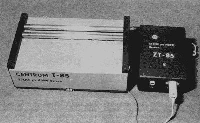
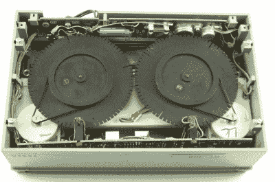
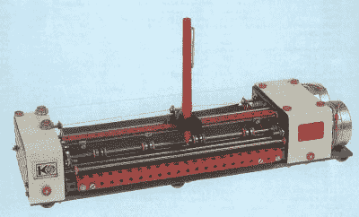
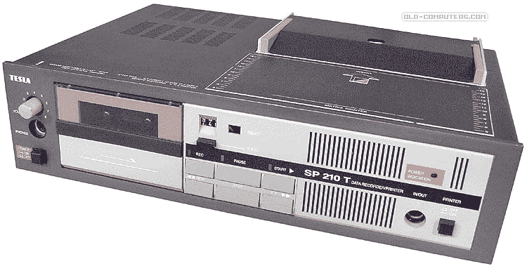
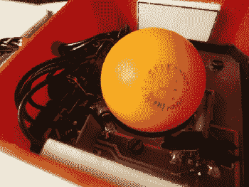

# 铁幕后面的外围设备

> 原文：<https://hackaday.com/2015/04/13/peripherals-behind-the-iron-curtain/>

铁幕后的家用电脑这篇文章引发了很多兴趣，让我很开心。因此，我决定引进更多铁幕时期的电脑珍品，尤其是来自前捷克斯洛伐克(CSSR)的。

正如我在上一篇文章中提到的，捷克斯洛伐克缺乏备件、文献和技术，迫使极客们自己解决这个问题:通过即兴创作和我们今天称之为“黑客攻击”一个人或一个小团体的业余爱好项目最终被一家国有企业接管，该企业随后开始制造产品，并在稍加修改后交付给商店。这些项目通常涉及各种各样的外围设备，这些设备很难在捷克斯洛伐克找到。

就像部件的生产一样，外围设备的生产也分布在整个东部地区，因此每个国家都专门生产某些类型的外围设备。例如，东德生产矩阵打印机，保加利亚制造软盘驱动器。这意味着工业企业必须等待重要的计算机部件，因为另一个国家的生产甚至不足以满足当地的需求，更不用说家庭用户了。

## BT-100

如果你从西方带了一台没有打印机的电脑，比如 Spectrum 或 Atari，你在 CSSR 几乎没有机会买到。您会设法通过您的朋友网络来清理一些废弃的矩阵打印机，但随后您偶然发现需要通过非标准接口连接它并为它编写驱动程序。当打印机使用 Centronics 接口和标准 Epson 控制代码时，你会认为自己很幸运。因此，出现了各种在家制造打印机的尝试。你认为这不可能吗？

Centrum T-85\. Image schotek.cz

在较大的城市里，成立了俱乐部，由唯一的全国性青年组织正式覆盖，但它们大多不受任何意识形态的约束。他们聚集了建模师、电气工程师、计算机爱好者和其他技术爱好者。这些俱乐部通常有更好的方法来获得一些技术或更昂贵的设备。在这样一个俱乐部里，一点打印机 Centrum T85 诞生了。在对机械部件和电子设备进行了几次修改后，特斯拉(上一篇文章中提到的电子设备制造商)开始以 BT-100 的名义进行生产。

BT-100 是一台非常简单的打印机，由两个电机和一个继电器组成。一个马达转动压轮并推动纸张，另一个马达推动带有打印头的小车，打印头具有电磁控制的钝头。笔尖在纸上左右滑动，在纸上点击出一个点。打印机还有两个带凹槽的轮子，可以产生同步脉冲。

打印机没有使用任何色带。通过将一张纸和复写纸一起放在滚筒下实现印刷。打印头点击的地方在纸上留下了印记。这种印刷技术产生了一个恰如其分的绰号“逃跑的钉子”。

The underside of the BT-100 printer. Image from nostalcomp.cz

打印机的内部布线非常原始:3 个电机驱动器、用于拉动打印头的励磁线圈和用于偏移纸张、滑架和范围的光电传感器。该接口使用四个输入信号(左滑架、右滑架、进纸和尖端拉动)和四个输出信号(信号范围、偏移纸张脉冲传感器和两个脉冲头移动传感器)。界面真的非常简单，所有的工作都交给了控制程序。

打印机可以单向或双向打印(打印一张 A4 纸大约需要 10 分钟，单向打印需要 20 分钟)。即使打印机本身是一个技术黑客，它被用户进一步修改。他们提高了打印头的移动速度，增加了凹槽以提高打印精度(没有这些调整，它的分辨率为每行 480 点，因此大约为 60 DPI)，并进行其他调整以提高速度和打印质量。出于好奇，我要提到一个在捷克斯洛伐克流传的程序——它能够通过精确的定时控制从打印机中引出一段简单的旋律。

这台打印机当然不是打印源代码或任何文档的最佳工具。它设法一次只打印几页，即使这样也要花上几十分钟:

[https://www.youtube.com/embed/0cwn8_0KPTo?version=3&rel=1&showsearch=0&showinfo=1&iv_load_policy=1&fs=1&hl=en-US&autohide=2&wmode=transparent](https://www.youtube.com/embed/0cwn8_0KPTo?version=3&rel=1&showsearch=0&showinfo=1&iv_load_policy=1&fs=1&hl=en-US&autohide=2&wmode=transparent)

一款名为 Gamacentrum 01 的类似打印机使用了稍微不同的设计。它在一个打印头上配备了两个打印头(两个“钉子”)，彼此之间的距离为半页。在打印过程中，每个笔尖打印了半页。打印质量仅略高于 BT-100，而打印机的价格仍然是它的三倍。

[https://www.youtube.com/embed/OxaaaTCUS3k?version=3&rel=1&showsearch=0&showinfo=1&iv_load_policy=1&fs=1&hl=en-US&autohide=2&wmode=transparent](https://www.youtube.com/embed/OxaaaTCUS3k?version=3&rel=1&showsearch=0&showinfo=1&iv_load_policy=1&fs=1&hl=en-US&autohide=2&wmode=transparent)

## 阿尔菲

大约在 1925 年，前捷克斯洛伐克共和国发明了一种儿童套件，它是基于用螺钉和螺母连接穿孔金属板。这个工具包被称为 [Merkur](http://www.merkurtoys.cz/en/) 。60 年代后期，它被出口到整个欧洲，捷克斯洛伐克的几代儿童(毫不夸张地说)伴随着它长大。该套件易于使用，同时允许以丰富的想象力组装几乎任何东西。隐形眼镜的发明者[奥托·威奇特尔勒](http://en.wikipedia.org/wiki/Otto_Wichterle)在离心机上创造了他的第一个原型，[就是由这个套件](http://www.merkurtoys.cz/wichterleho-cockostroj-z-merkuru)制成的。

A plotter made from Merkur. Image from merkurtoys.cz

80 年代，工程师 Vladimír Doval 用这个工具包制作了一个简单的绘图仪，并将其命名为 Alfi。它的结构比上面提到的 BT-100 要复杂一些。作者使用了两个步进电机(一个用于进纸，另一个用于移动笔)和电磁控制笔的下降。组装说明随后发表在“青年科学技术”(VTM)杂志上，不久之后，这些绘图仪开始出现在捷克斯洛伐克计算机爱好者的桌子上，他们翻遍他们的阁楼，寻找装有他们童年工具包的满是灰尘的盒子。一个简单的接口被用来连接绘图仪，主要由 8255 电路构成。

阿尔菲并不局限于绘图笔——有些人甚至使用自制的光学笔，并创造了原始的扫描仪。Alfi 确实非常简单，因为它再次完全依赖于计算机软件，但质量非常好-速度为每秒 50 毫米，最小步长为 0.15 毫米。

阿尔菲主谋活到今天，在这个视频里可以看到:[【https://www.youtube.com/watch?v=LBip6q0qjDk】](https://www.youtube.com/watch?v=LBip6q0qjDk)

如果你不想自己建造绘图仪，在 80 年代末你有几种选择。例如，您可以购买绘图仪 mini graf 0507(arit ma 制造)或 XY41xx 系列绘图仪(实验室设备制造)。它们提供了与 Alfi 大致相同的性能，顶级型号 XY4160 包含自己的处理器，并理解 HPGL 语言。

[https://www.youtube.com/embed/BmSXX1-Q-wg?version=3&rel=1&showsearch=0&showinfo=1&iv_load_policy=1&fs=1&hl=en-US&autohide=2&wmode=transparent](https://www.youtube.com/embed/BmSXX1-Q-wg?version=3&rel=1&showsearch=0&showinfo=1&iv_load_policy=1&fs=1&hl=en-US&autohide=2&wmode=transparent)

## SP210T

在上一篇文章中，我已经提到软盘不是社会主义市场中的普通股票。软驱主要在保加利亚生产，其产量肯定不能满足需求。在捷克斯洛伐克，它们主要属于工业计算机，而“家用”计算机只能满足于普通的盒式磁带。

尽管如此，许多不同的软盘驱动器出现了。例如，一台学校计算机 IQ-151 装配了一个 8”软盘驱动器(又名“老师的计算机”)和一个由几台其他计算机(“学生的计算机”)组成的网络。他们有一个 CP/M 的克隆，以及 WordStar 文本编辑器和 Pascal 编译器。后来，在该政权垮台后，从世界进口被允许和更新，大规模生产的驱动器以及其他计算机被创造出来。

只有一些幸运者从西方国家为他们的计算机带来了软驱(通常是 Commodore)。其他人获得或建立了一个光谱测试盘。它的自定义界面并不是什么大问题，因为使用说明会在杂志上发表，但是硬盘本身很难找到，你需要一个熟人或者自己从国外带来。

在很长一段时间里，最常见的外设仍然是盒式录音机，人们中的许多人都有不同的出处和质量，从怪异的塑料实验到几乎专业的作品。特斯拉可以展示他们自己的卡式录音机 SM260，它有着令人惊讶的体面设计，这在当时对捷克斯洛伐克的电子设备来说当然是一个例外。特斯拉然后修改了他们的卡式录音机，删除了放大器的电源部分，结果是一个“数据记录器”SP210。它的结构相同，但设计略有不同:前部装有扬声器，录音机包含一个麦克风，通过它你可以制作录音的序言，甚至可以直接使用简单的 TTL 接口从计算机接收控制，包括倒带和录音。甚至有一个模块允许计算机 SAPI-1 使用 SP210 作为 CP/M 的记录设备

由于音频位的删除留下了一个相对较大的空间未使用，创作者认为将前面提到的打印机 BT-100 纳入该空间。这样就制造出了 SP-210T 型。

The Tesla SP-210T cassette deck/printer Image from old-computers.com

特斯拉在盒式磁带 SP210 和 BT-100 打印机之间创造了一个非常超现实的混合体，并将其命名为 SP210T。SP210T 将录音设备和打印机合二为一。西方认为稀奇的东西在捷克斯洛伐克是一种严肃的产品。这台打印机已经逐渐连接到捷克斯洛伐克的几乎每一台计算机，从 ZX 光谱和雅达利到捷克斯洛伐克的 PMD-85 计算机。

但 SP210T 并不是具有相同设计的最新技术:1990 年，生产开始于 PMD-32 软盘驱动器(顾名思义，它是 PMD-85 的外围设备)——同样，与 SP-210T 在同一盒子中。它包含两个 5.25 英寸驱动器、基于 FDC i8227 和 DMA i8257 的控制器和一个控制电路，其中所有工作都由 8080 处理器负责。PMD 计算机使用基于 8255 电路的接口进行通信。

## 电脑鼠标

这种家酿计算机鼠标的创造者认为鼠标没有什么太难的，这是正确的。它只是一个将运动传递给垂直滚轴的球，这种运动以某种方式被测量。他们坐下来组装自己的鼠标，这有点像狂热的杂工的梦想。自己判断:

The roller ball of a homemade mouse. It’s a ping pong ball.

他们用塑料厨房调料罐作为老鼠的住所。他们在罐子里放了一块电路板，上面有两个相互垂直的金属滚筒。在两个滚筒上都有一个由厚纸制成的锯齿状孔。使用一个 LED 和一对光电晶体管来读取它的位置。前面有两个按钮。每个按钮都是由一个带帽螺钉和一对缩短弯曲的安全别针制成的。(为什么？嗯，因为在捷克斯洛伐克很长一段时间都买不到微型开关！)球，鼠标的重要组成部分，换成了乒乓球。这根电缆是由八根电线交织而成的。

所有这些都是成套制造和供应的。你可以在商店里买，然后在家里组装。[这里有一份施工手册](http://sam.speccy.cz/olddocs/mys602_navod_ke_stavbe.pdf) (PDF，捷克语)。

最认真的发烧友为了更好的贴合和动作传递，用别出心裁的方式给乒乓球填充了很重的压舱物。

这个外围设备非常简单，并加入了一些并行接口。剩下的必须由软件来处理。该套件附带的专有驱动程序使用中断来确定光圈的位置。由于频谱上的中断频率为 50 赫兹，这意味着在鼠标快速移动时扫描是不精确的。因此，作者建议使用某种图表，这增加了中断的频率。

大概生产了 5000 个这样的套件，这在捷克斯洛伐克是一个很大的数字，因为那里的小型计算机配件是以几百个为一个系列生产的。

我用一种有点奇怪的方式得到了我的鼠标:1988 年的某个时候，捷克斯洛伐克当局决定支持年轻人用电脑工作，于是一个国际游戏的想法诞生了。制作了一个机器人的文本游戏城市，然后移植到几个平台(Spectrum、PMD-85、IQ-151、夏普 MZ-800 和翁德拉)，并以磁带形式分发给感兴趣的各方。为了确保每个人都有相同的条件，游戏需要一个密码，这个密码将在特定的日期在国家电视台的主要新闻广播中公布。

不幸的是，由于作者的错误，密码可以在二进制文件中读取，所以它已经在游戏开始前就传遍了捷克斯洛伐克。在那一天的新闻中，播音员说出了这个不幸的密码(它是“konvalinka”，或英语中的“lily”)，并补充道“给那些还不知道它的人”。而且因为连每个人的条件都没有，所以抽到了获奖者，我收到了鼠标套件作为奖品。

当然，捷克斯洛伐克也在 80 年代末制造了电脑鼠标，比如 3WN16605/16607。

## 最后

在捷克斯洛伐克，在铁幕落下后，为家用 8 位计算机创建外围设备并进行小批量生产一直持续到 90 年代初。随着社会主义的崩溃，合法生产这些配件成为可能，因此新的制造商抓住了这个机会，开始供应更大系列的带有英特尔 8255 或音频外设的通用接口，如 T2 通用仪器 AY-3-8912 或 T4 飞利浦 SAA-1099 T5。但边界的开放也意味着 PC 的入侵，科技爱好者转投 Amiga，八位时代慢慢结束…

我当然没有描述所有在捷克斯洛伐克制造或自制的前外设。我们可以在其他时间介绍“社会主义集团”的其他电脑珍品——从门铃按钮制成的操纵杆到 ZX 频谱的克隆，其中 ULA 电路被几十个标准 TTL 74xx 系列芯片取代……

* * *

## 关于作者

 【马丁·马尔】为捷克一些报纸担任媒体技术顾问和开发团队负责人。他有创业的经验，做过很多网络项目(例如，他是捷克博客系统 Bloguje.cz 的首席开发人员、程序员、管理员、经理和思想家)。

除了编程，他最大的爱好是微电子和旧电脑。他在基于微控制器(8051 系列、AVR、微芯片)和一些“自制”小工具、计算机等的铁路引擎上做了一些任务编程。他在[ASM80.com](http://hackaday.com/2014/11/15/multi-target-ide-for-8-bit-cpus/)将他的两个爱好结合在一起——一个 8 位 CPU 的在线 IDE 和汇编程序。

[Martin]是新 Web 技术(OpenID、OAuth、云计算、HTML5、Node.js、Coffeescript 和其他东西)的倡导者和教师，也是移动设备 HTML5 开发的倡导者。

他写了很多东西——从一些青少年的文本实验开始，通过一系列博客和在线杂志继续，他最终成为了关于网络技术的在线杂志 zdrojak.cz 的主编。