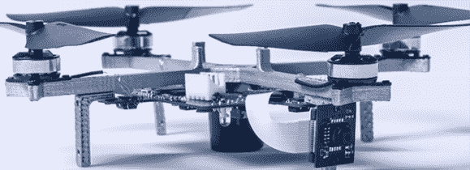

# Phenox:其中四轴飞行器获得 FPGAs

> 原文：<https://hackaday.com/2014/05/11/phenox-wherein-quadcopters-get-fpgas/>

四轴飞行器内部的计算能力足以读取几个陀螺仪和加速度计，进行一些数学计算，并计算出向马达发送多少功率。如果一架四轴飞行器拥有更强的计算能力和足够多的外设来做一些很酷的事情会怎么样？[这就是 Phenox 通过一个能够运行 Linux 的微型四核处理器所做的事情](http://phenoxlab.com/)。

Phenox 看起来像任何其他微型四轴飞行器，但在引擎盖下，事情变得有趣得多。与通常基于微控制器的控制系统不同，Phenox 采用了 ZINQ-7000 片上系统，具有带 FPGA 和少量 DDR3 内存的 ARM 内核。这使得 quad 可以运行 Linux，通过添加两个摄像头(一个面向前，一个面向下)、一个麦克风、一个 IMU 和一个距离传感器，这变得更加有趣。基本上，如果你想要一个可以悬停的机器人宠物，从飞鸿开始就不错了。

Phenox 背后的人明天会推出一个 Kickstarter。没有消息说一辆基本款的 Phenox 要花多少钱，但它可能会比你在中国普通零售商那里买到的便宜的 quads 贵一点。

下面的视频。

[https://www.youtube.com/embed/vx6_it0OVB4?version=3&rel=1&showsearch=0&showinfo=1&iv_load_policy=1&fs=1&hl=en-US&autohide=2&wmode=transparent](https://www.youtube.com/embed/vx6_it0OVB4?version=3&rel=1&showsearch=0&showinfo=1&iv_load_policy=1&fs=1&hl=en-US&autohide=2&wmode=transparent)

[https://player.vimeo.com/video/86820983](https://player.vimeo.com/video/86820983)[https://player.vimeo.com/video/89286988](https://player.vimeo.com/video/89286988)