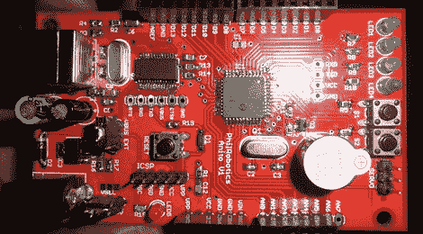

# PhilRobokit Anito 不是 Arduino 人

> 原文：<https://hackaday.com/2012/07/12/philrobokit-anito-is-not-an-arduino/>

菲律宾 hackerspace PhilRobotics 的几个人[一个基于 PIC 的开发板](http://www.philrobotics.com/philrobokit-anito)从“人人都讨厌的微控制器板”Arduino 中获取了许多线索。

Anito 中使用的 PIC16F877a 和 Arduino 中使用的 ATMega328 之间有一些差异:PIC 的闪存不到“兆和更少 RAM”的一半，但时钟频率略高。如果有一个带有 Arduino 风格接口的开发板，由这些新的 PIC32MX 芯片中的一个驱动，那就太好了，如果仅仅是因为我们看到的一些[真正的](http://hackaday.com/2012/06/15/putting-an-atari-pokey-in-your-pocket/)、[真正的](http://hackaday.com/2012/01/23/maximite-harkens-back-to-the-days-of-basic/)令人敬畏的项目。我们会拿走我们能得到的任何东西，即使它为 PIC/AVR 圣战提供了更多的弹药。

Anito [的一个真正有趣的方面是 IDE](http://www.philrobotics.com/philrobokit-ide-update) 。用 Python 编写的 PhilRoboKit IDE 具有每个人都喜欢的用 Wiring 编写的 IDE 的所有功能，外加一些额外的功能:autocomplete 是一个巨大的好处，因为它能够通过 Pickit2 ISP header 上传程序。IDE 可用于 Windows 和 Linux(还没有 Mac 端口)，应该足以让您在 PIC 开发世界中起步。