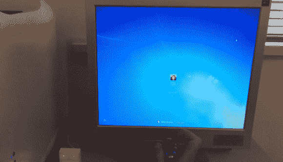

# 物理钥匙不再仅仅用于门，现在也可用于窗户

> 原文：<https://hackaday.com/2014/05/29/physical-keys-not-just-for-doors-anymore-now-available-for-windows/>

如果你在一个漫长的周末后忘记了你的电脑密码，或者也许你能记起来，但似乎就是不能正确地键入密码，[托马斯]有一个项目给你。这是一把[物理钥匙](http://www.instructables.com/id/Arduino-Leonardo-Windows-7-8-Key-Switch-Fast-Lock/)，可以锁定和解锁你的电脑。

那么它是如何工作的呢？该项目的核心是一个 Arduino [莱昂纳多](http://arduino.cc/en/Main/arduinoBoardLeonardo)。您可能还记得，这款主板与之前的 Arduinos 略有不同，因为它可以在主机上作为人机界面设备( [HID](http://en.wikipedia.org/wiki/Human_interface_device) )进行枚举，例如键盘或鼠标。Arduino 草图使用内部上拉电阻持续读取输入引脚，使其变为逻辑高电平，按键开关将信号接地。当 Arduino 看到 pin 从高变到低时，它会发出一个由 Windows 键和“L”组成的键盘命令，这是锁定电脑的键盘快捷键。

当再次转动物理键时，Arduino 会看到 pin 变回高状态，并再次模拟键盘，但这一次输入您的密码。您必须在 Arduino 草图中包含您的密码，这样才能工作。此外，还有两个 LED 显示电脑是否锁定，但当你试图回到工作时，你可以很快知道。

如果你想自己做一个，Arduino 草图和 Frtitzing 图可以在上面的链接中找到。

[https://www.youtube.com/embed/gBPy88_ZFAY?version=3&rel=1&showsearch=0&showinfo=1&iv_load_policy=1&fs=1&hl=en-US&autohide=2&wmode=transparent](https://www.youtube.com/embed/gBPy88_ZFAY?version=3&rel=1&showsearch=0&showinfo=1&iv_load_policy=1&fs=1&hl=en-US&autohide=2&wmode=transparent)