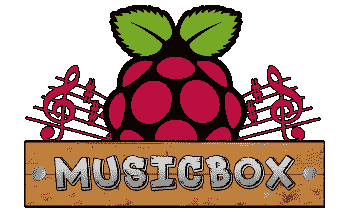

# Pi Musicbox 0.5 发布

> 原文：<https://hackaday.com/2014/07/13/pi-musicbox-0-5-released/>

再来一杯树莓派怎么样？Pi MusicBox 提供了一种方法，可以快速将它转变为一个独立的流媒体设备，可以从大量来源获取音乐。最新发布的 Pi MusicBox 增加了许多新功能。

我们在一年多前看了一下这个软件[，注意到它使流媒体 Spotify 变得容易，并且支持使用](http://hackaday.com/2013/03/14/raspberry-pi-as-a-spotify-server-with-mpd-control/)[音乐播放器守护进程](http://www.musicpd.org/) (MPD)控制曲目。最新版本支持 AirPlay、DNLA、谷歌音乐、SoundCloud 和其他几个音乐来源。

由于 Pi 上的模拟音频输出不是很好，Pi MusicBox 包括对各种 USB 声卡的支持。还可以使用 HDMI 端口进行数字音频输出，它可以连接到您的家庭影院系统。

如果你想建立一个独立的音乐设备，这看起来是一个很好的起点。用户社区已经建立了各种运行该软件的项目，这些项目在 [Pi MusicBox 主页](http://www.pimusicbox.com/)上有所介绍。