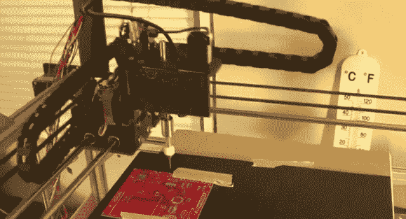

# 挑地方那个不能挑地方…但是看起来很有前途

> 原文：<https://hackaday.com/2012/11/20/pick-and-place-that-cant-pick-or-place-but-it-looks-very-promising/>

这个性感的 CNC 真的会飞。这是一台[Danh Trinh]一直在研究的拾放机。问题是，到目前为止，它根本没有移动部件的能力。但好消息是系统的其他部分似乎还在。

他发布了一个演示视频，展示了他到目前为止的进步，你可以在休息后看到嵌入的视频。他首先展示了他用 C#编写的计算机视觉软件。该演示包括从安装在机架上的摄像头观看，以及计算机过滤，这似乎可以准确地定位 PCB 上的焊盘和丝网。视频的后半部分着眼于上面看到的硬件。它只是执行一些静态代码，但那些步进电机的呜呜声对我们来说就像音乐一样美妙。[Danh]报道称，最终用作真空镊子尖端的针的运动似乎非常精确。

这些自制的拾放项目相当具有挑战性，但是[我们最近已经看到了很多非常棒的工作。](http://hackaday.com/2012/10/29/diy-pick-and-place-builds-boards-is-awesome/)

[https://www.youtube.com/embed/emGQ80bTtBs?version=3&rel=1&showsearch=0&showinfo=1&iv_load_policy=1&fs=1&hl=en-US&autohide=2&wmode=transparent](https://www.youtube.com/embed/emGQ80bTtBs?version=3&rel=1&showsearch=0&showinfo=1&iv_load_policy=1&fs=1&hl=en-US&autohide=2&wmode=transparent)