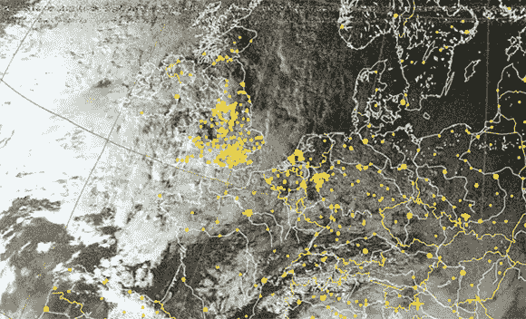

# 使用 USB 电视调谐器从气象卫星拍摄的图片

> 原文：<https://hackaday.com/2013/01/04/pictures-from-weather-satellites-with-a-usb-tv-tuner/>

一天中有几次，NOAA 气象卫星从你的头上经过，向你传送天气系统和云形成的图片。这些传输没有加密，如果有必要的硬件，你有可能从太空下载这些图像，就像[Lovro]在教程视频中向我们展示的[。](http://www.youtube.com/watch?v=fopnIkYnFPI)

为了获得这些近乎实时的卫星图片，[Lovro]使用了我们越来越喜欢的 USB 电视调谐器之一。接收 NOAA 气象卫星的右旋极化传输需要一个有点特殊的天线，但用一些木头和电线，[Lovro]制作了一个螺旋天线来监听气象卫星在 137 MHz 左右的传输。在用 [SDRsharp](http://sdrsharp.com/) 从卫星上收集了一大堆数据后，【洛夫罗】用[图像解码器](http://www.wxtoimg.com/)将一个音频文件转换成几个小时前从太空拍摄的图片。

这不是我们第一次看到用软件无线电下载的 NOAA 气象卫星的图像；去年[hpux735] [用一款不太贵的](http://hackaday.com/2011/10/20/grab-your-own-images-from-noaa-weather-satellites/)[软石 SDR](http://www.wb5rvz.com/sdr/) 做到了这一点。[Lovro]使用 USB 电视调谐器接收来自 NOAA 卫星的传输要容易得多，尽管最大的支出是建造螺旋天线的时间投资。