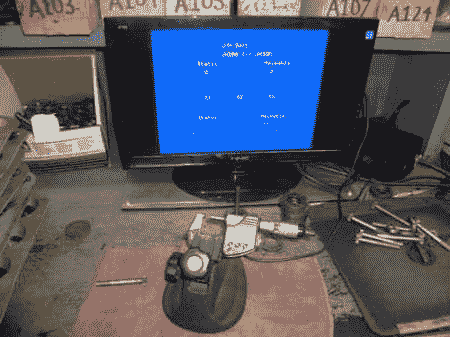

# 将测微计数据传输到 VGA

> 原文：<https://hackaday.com/2012/06/03/piping-micrometer-data-to-a-vga/>

[sspence]发现自己需要一种方法来将数据从他的数字测微计推送到 VGA 面板以便于显示。他的千分尺有一个数据端口，所以他想他可以把它插入一个微控制器，然后把数据推送到 VGA。千分尺以相反的顺序吐出 52 个字符的数据流，所以他必须在软件中以正确的顺序重新组合。在对古怪的数据流做了一点逆向工程后，他用 Arduino 提取了串行数据。剩下的就是为输出增加一个 VGA 屏蔽。

不过，他想进一步扩展这一点，所以他添加了一个脚踏开关和手指开关，以允许进行多次测量并显示平均值。最后，他的千分尺有了一个巨大的显示屏，这正是他想要的。

我们预计，有人会问为什么他选择使用 arduino 和屏蔽，而不是设计一个元件和成本更少的定制电路。我们猜测他的目标是“为齿轮组生成箱号”，他只是需要一个升级的工具。他的目标不是研究设计和实现最有效的电路。也就是说，如果有人想为此设计一个更小的包，请随意与我们分享！