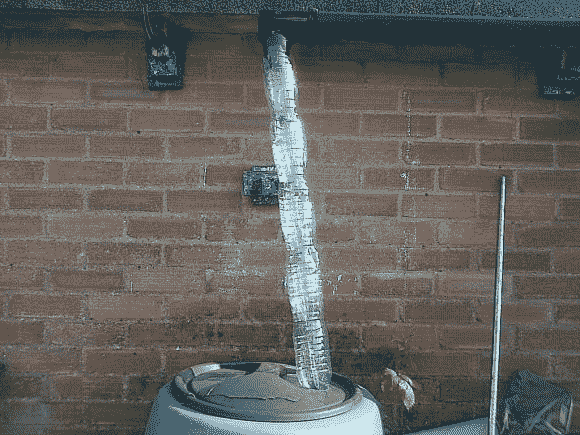

# 塑料瓶将雨水收集到雨水桶中

> 原文：<https://hackaday.com/2013/07/15/plastic-bottles-funnel-rain-in-rain-barrels/>

这是[Wombling 的]零成本解决方案，将雨水从他的水槽中收集到雨水桶中。它实际上只是一堆用链条连接在一起的塑料水瓶。在一端，他用原来打了一些孔的帽子作为筛子。

我们喜欢这个概念，但觉得执行起来有点可疑。在大雨中，帽子上的孔将无法保持，我们认为你的水槽会溢出。这可能是好的，取决于你的景观等级，但是那些重视保持地下室干燥的人应该避免走这条路。

一点点的改进就能改变这一切。我们建议用雨水桶做筛子。在盖子上添加一个碗形，底部有一大块滤网，可以过滤掉碎片。然后在盖子的前侧形成某种类型的喷口，以引导溢出物离开房屋。

瓶装水产生的大量废物一直困扰着我们，这也是我们选择这个话题的部分原因。我们也喜欢看那些[塑料瓶天窗](http://hackaday.com/2011/03/08/soda-bottle-skylights/)，并且可以发誓我们展示了一个建在海洋中的漂浮塑料瓶岛，但是找不到其中的联系。如果你知道我们在谈论什么，请在评论区留下商品。