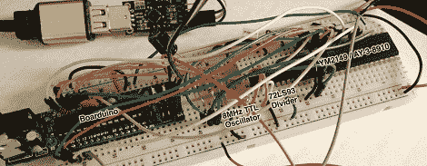

# 使用 YM2149 播放 Chiptunes 并优化 Arduino

> 原文：<https://hackaday.com/2012/04/10/playing-chiptunes-with-a-ym2149-and-optimizing-an-arduino/>

[Oryx]伴随着 Atari ST 的哔哔声和滴答声长大，所以毫不奇怪他会想通过玩他最近在易贝买的 YM2149 声音发生器来享受他的怀旧之情。像我们大多数人一样，[Oryx]在将这个裸芯片连接到他的计算机时，使用了他的旧备用设备 Arduino。第一个电路没有工作，所以在对固件进行了大量的探索后，[Oryx]发现了手动优化软件的好处。

互联网上流传着很多 YM2149 的声音文件。这些文件只是 16 个寄存器在 50Hz 下的转储，因此通过串行连接将它们从计算机发送到 Arduino 非常容易。不幸的是，当[Oryx]建立起他的面包板时，什么也没发生。在破解了示波器之后，他发现 Arduino 切换引脚的速度比 YM2149 数据手册要求的速度慢 100 倍。

[Oryx]记得看过一篇很棒的博客文章讨论 digitalWrite()函数改变 pin 状态的速度。我们在之前已经[见过这种情况，在 Arduino 上改变 pin 状态最快的方法是丑陋的按位操作。在修改了几行代码后，[Oryx]几乎同时切换了两个引脚。](http://hackaday.com/2010/08/19/todays-arduino-moment/)

既然 YM2149 芯片工作正常，[Oryx]正计划用他的项目制作一个 MIDI 合成器。你可以从他在休息后上传的演示视频中了解到这一点。

[https://www.youtube.com/embed/8U6ZYENWb24?version=3&rel=1&showsearch=0&showinfo=1&iv_load_policy=1&fs=1&hl=en-US&autohide=2&wmode=transparent](https://www.youtube.com/embed/8U6ZYENWb24?version=3&rel=1&showsearch=0&showinfo=1&iv_load_policy=1&fs=1&hl=en-US&autohide=2&wmode=transparent)