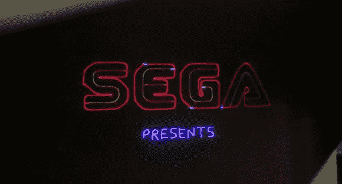

# 在 RGB 激光投影仪上玩 MAME 游戏

> 原文：<https://hackaday.com/2013/03/12/playing-mame-games-on-a-rgb-laser-projector/>

基于矢量的显示在 70 年代和 80 年代被用于街机游戏。典型的 CRT 使用光栅图形，它是通过将一束网格图形偏转到磷光体上来显示的。向量显示器以线而不是完整的网格来偏转光束，仅绘制所需的向量。也许最著名的矢量游戏是原始小行星。

[Jeremy]建造了一个 RGB 激光投影仪，并想在上面运行一些经典的街机游戏。他开始使用 XMAME 模拟器，但必须修改它才能与激光器通信并减少显示器上的闪烁。

为了控制激光，使用了改良版的 [OpenLase](https://github.com/marcan/openlase "OpenLase") 。这必须得到增强，以支持 RGB 颜色。 [MAME 模拟器](https://github.com/jv4779/openlase-mame "OpenLase-MAME on Github")和 [OpenLase](https://github.com/jv4779/openlase "RGB OpenLase on Github") 的修改后的源代码都可以在 Github 上获得。

[Jeremy]的朋友[Steve]甚至在这个系统上开发了一个基于矢量的游戏。“第六次世界大战”是一场关于 vi 和 emacs 文本编辑器的激烈战斗。

休息后，构建结果将在一系列视频中展示。

[https://www.youtube.com/embed/VBALyh1hw5Y?version=3&rel=1&showsearch=0&showinfo=1&iv_load_policy=1&fs=1&hl=en-US&autohide=2&wmode=transparent](https://www.youtube.com/embed/VBALyh1hw5Y?version=3&rel=1&showsearch=0&showinfo=1&iv_load_policy=1&fs=1&hl=en-US&autohide=2&wmode=transparent)

[https://www.youtube.com/embed/S2JKr-Vkz8A?version=3&rel=1&showsearch=0&showinfo=1&iv_load_policy=1&fs=1&hl=en-US&autohide=2&wmode=transparent](https://www.youtube.com/embed/S2JKr-Vkz8A?version=3&rel=1&showsearch=0&showinfo=1&iv_load_policy=1&fs=1&hl=en-US&autohide=2&wmode=transparent)

[https://www.youtube.com/embed/OHbsrLW-iag?version=3&rel=1&showsearch=0&showinfo=1&iv_load_policy=1&fs=1&hl=en-US&autohide=2&wmode=transparent](https://www.youtube.com/embed/OHbsrLW-iag?version=3&rel=1&showsearch=0&showinfo=1&iv_load_policy=1&fs=1&hl=en-US&autohide=2&wmode=transparent)