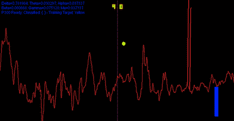

# 用你的思想玩乒乓球

> 原文：<https://hackaday.com/2012/05/01/playing-pong-with-your-mind/>

看来(查尔斯·莫耶斯)和(孟想·江)再也不会受雅达利控制器带来的手腕和拇指酸痛之苦了。他们制作了一个 Pong [版本，在戴着脑电图耳机的情况下，通过集中注意力和放松](http://people.ece.cornell.edu/land/courses/ece4760/FinalProjects/s2012/cwm55/cwm55_mj294/index.html#)来玩。

现在，硬件只够一个玩家使用；当操作红色桨的玩家集中注意力时，桨向上移动——放松，桨向下移动。

构建的硬件部分是相当棘手的事情。[查克]和[孟想]建立了一个电路，将他们耳朵之间的微小电压放大成微控制器可以读取的东西。该电路大致基于这个 Arduino EEG 构建，但按照 ATMega644 的优雅要求进行了高度改进。

脑电图放大器的截止频率低于 50 赫兹，非常适合读取与注意力相关的α波。来自头盖骨的振动通过 ATMega 发送到 MATLAB，在经过 FFT 后，脑电波被转换成鼠标滚轮输出。

有一个演示视频，你可以看到观众对着可怜的测试对象尖叫，告诉他放松，集中注意力。休息之后你可以去看看。

[https://www.youtube.com/embed/uYQfdA2tXbc?version=3&rel=1&showsearch=0&showinfo=1&iv_load_policy=1&fs=1&hl=en-US&autohide=2&wmode=transparent](https://www.youtube.com/embed/uYQfdA2tXbc?version=3&rel=1&showsearch=0&showinfo=1&iv_load_policy=1&fs=1&hl=en-US&autohide=2&wmode=transparent)

[【查尔斯·莫耶斯】【孟想·江】派出了他们的](https://sites.google.com/site/chipstein/home-page/eeg-with-an-arduino)