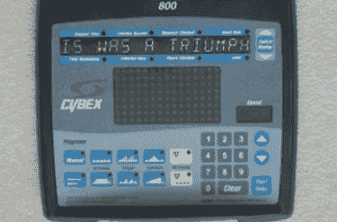

# 在被黑的健身设备上播放歌曲“还活着”

> 原文：<https://hackaday.com/2012/05/05/playing-the-song-still-alive-on-hacked-exercise-equipment/>

早在 2009 年，[Evi1wombat]就实现了这一有趣的黑客行为，它慢慢地通过互联网找到了今天的我们。他从一台最近去世的跑步机上获得了这台电脑，并决定入侵它。发现自己无法闪存现有的芯片，他把它拉了出来，换上了他更熟悉的东西，一个 dsPIC30F4011。不幸的是，我们没有任何内部的照片，但他说他对电线很感兴趣，因为引脚映射并不完全相同。从[源代码](http://www.club.cc.cmu.edu/~smoskovc/portal.c)中引用的这段话来看,【Evi1wombat】也赢得了一些对原设计师的尊重:

> *该死，设计那块板的家伙玩了
> *一些漂亮的把戏…花了一段时间
> *让所有的驱动程序工作。

当然，一旦你控制了一些漂亮的新硬件，第一件合乎逻辑的事情就是从游戏门户玩“仍然活着”。

休息后请欣赏视频。
 [https://www.youtube.com/embed/hfmGnLMlKvs?version=3&rel=1&showsearch=0&showinfo=1&iv_load_policy=1&fs=1&hl=en-US&autohide=2&wmode=transparent](https://www.youtube.com/embed/hfmGnLMlKvs?version=3&rel=1&showsearch=0&showinfo=1&iv_load_policy=1&fs=1&hl=en-US&autohide=2&wmode=transparent)