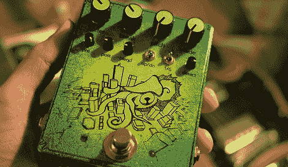

# 玩 DSP 和建立吉他踏板

> 原文：<https://hackaday.com/2012/08/23/playing-with-dsp-and-building-a-guitar-pedal/>

从连接几个晶体管到构建一个简单的升压电路，构建吉他踏板已经走过了漫长的道路。[Cloudscapes]一直在致力于[一个反鹦鹉螺自动故障，自动重复踏板](http://soniccrayon.blogspot.com/2012/08/anti-nautilus-or-autoglitch.html)，如果你正在寻找一种听起来像在电唱机上跳过意大利面条的西方配乐的东西，我们想不出更好的东西。

[Cloudscapes]已经熟悉了 8 位 AVR，但在进行实时音频采样时，更强大的微控制器更合适。他转向 MikroElektronika MINI-32 板进行开发。这款小型电路板将 PIC32 微控制器集成到易于电路板化的 DIP-40 外形中，非常适合与一些功能强大的硬件配合使用。

对于 DAC，[cloudscape]有一些使用 16 位 PT8211 的经验，但在一个方便的封装中找到一个好的 16 位 ADC 有点困难。他最终选定了 12 位的 MCP3201 ADC，对于一个被认为声音高保真的踏板来说绰绰有余。

在[Cloudscapes]做了几块板之后，他开始了他的 DSP 冒险。不幸的是，初始代码使用无符号 16 位字来表示每个样本，这意味着每次循环重复时，它都会从 0 开始，并在扬声器中产生一个短暂的爆音。经过一周的调试，[Cloudscapes]意识到有符号整数是存储音频数据的更好的数据格式，并解决了困扰他的项目的问题。

现在[Cloudscapes]有了一个很棒的 DSP 开发板，非常适合制作新的奇怪的吉他效果。休息之后，你可以听一个反鹦鹉螺踏板的演示，我们不得不说它听起来很棒。

感谢[Chris]发送这封邮件。

[https://www.youtube.com/embed/JdqwXGB0944?version=3&rel=1&showsearch=0&showinfo=1&iv_load_policy=1&fs=1&hl=en-US&autohide=2&wmode=transparent](https://www.youtube.com/embed/JdqwXGB0944?version=3&rel=1&showsearch=0&showinfo=1&iv_load_policy=1&fs=1&hl=en-US&autohide=2&wmode=transparent)