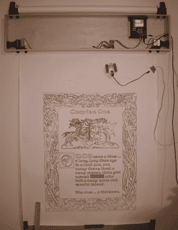

# 绘图仪机器人挂在你的墙上工作

> 原文：<https://hackaday.com/2013/11/06/plotterbot-hangs-on-your-wall-to-work/>

正在寻找一个有趣且容易完成的项目，开始进入充满乐趣的 Arduinos 世界吗？你自己的绘图机器人怎么样，恰如其分地命名为[绘图仪机器人！](http://plotterbot.com/2013/10/building-a-plotterbot-arduino-drawing-robot-an-overview/)

我们第一次听说这个项目是在[Jay]为我们的[小饰品比赛](http://hackaday.com/2013/11/01/trinket-contest-update-5/)提交了一个巨大的 Hack A Day logo 绘图版本时，我们非常喜欢这个绘图机器人，所以我们不得不给它一篇专题文章！

这是一个非常简单的设计，使用了一个 Arduino，2 个步进电机，一个伺服电机(用于提笔)，一些钓鱼线和各种你可能在房子里找到的零碎东西。实际上，它的造价大约是 100 美元，但是如果你能从一台旧打印机或扫描仪中回收一些零件，那就更低了！

[Jay]目前正在他的博客上发布一系列详细的帖子，解释建造一个的过程，但是如果你很兴奋马上开始，你可以随时查看他的 [FAQ](http://plotterbot.com/2013/09/plotterbot-frequently-asked-questions/) 以获得更多有趣的细节。