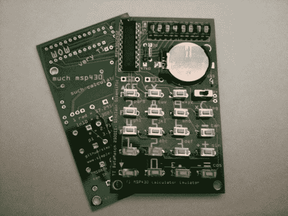

# 袖珍计算器模拟袖珍计算器

> 原文：<https://hackaday.com/2014/07/02/pocket-calculator-emulates-pocket-calculator/>

[Chris]制作了一个[袖珍计算器，它模拟了……一个袖珍计算器](http://www.simpleavr.com/msp430-projects/tms0803-5-emulating-calculator-build)。实际上，是两个袖珍计算器。受[【肯·希尔瑞夫】对辛克莱科学计算器的不可思议的逆向工程](http://hackaday.com/2013/08/30/ken-shirriff-completely-reverse-engineers-the-1974-sinclair-scientific-calculator/)的启发，【克里斯】决定将【肯的】辛克莱和 [TI Datamath 2500II 模拟器](http://files.righto.com/calculator/TI_calculator_simulator.html)带到现实世界。

这两款经典的 70 年代计算器都基于 TMS0805 处理器。0805 用 320 个 11 位字的 ROM 运行，只有三个存储寄存器。Sinclair 的 Nigel Searle 在一个设计成四功能计算器的芯片上实现了科学的计算器运算。

[Chris]决定通过使用德州仪器 msp430 微控制器进行仿真来保留家族中的一切。他改编了[Ken 的]模拟器代码，以便在 MSP430G2452 上运行。256 字节的内存和 8KB 的闪存让事情变得几乎太容易了。[Chris 的]包括 TI 和 Sinclair 计算器的 rom。TI Datamath ROM 是默认的，但是通过在引导期间按住 7 键，Sinclair ROM 被加载。丝绸屏幕包括两个计算器的关键图标，以及背面一些 Doge 启发的智慧。

玩笑归玩笑，这些确实是神奇的小计算器。当模拟的 TMS0805 执行算法运算时，当六七十岁的孩子看到 led 闪烁时，他们会被带回去。[克里斯的]代码在[Github](https://github.com/simpleavr/tms0800)上。虽然他还没有发布 gerbers，但是他已经在 43oh.com 论坛的[上展示了他的 PCB 布局图。](http://forum.43oh.com/topic/5524-tms08035-emulating-calculator-build/)

[https://www.youtube.com/embed/9ElT7siDtaE?version=3&rel=1&showsearch=0&showinfo=1&iv_load_policy=1&fs=1&hl=en-US&autohide=2&wmode=transparent](https://www.youtube.com/embed/9ElT7siDtaE?version=3&rel=1&showsearch=0&showinfo=1&iv_load_policy=1&fs=1&hl=en-US&autohide=2&wmode=transparent)