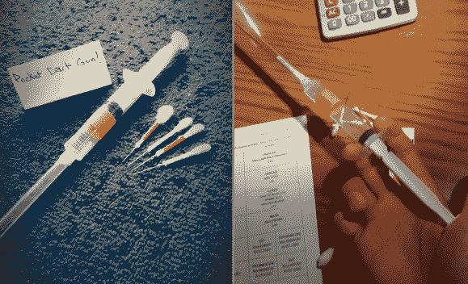

# 用于湿/干战斗的袖珍飞镖/吐球枪

> 原文：<https://hackaday.com/2014/03/01/pocket-dartspitball-gun-for-wetdry-combat/>

你能用针头、一次性注射器、强力胶、棉签和剪刀做什么？如果你回答“被 TSA 特工骚扰”，你就对了，但是你也可以做[Mski]做的事情，做一个袖珍镖枪！

【Mski】用的是 10mL 的注射器，透明的 BiC 笔身。他把笔筒粘到注射器上的针头适配器上，做成腔室。他用棉签剪成两半，然后插入涂有胶水的针来制作飞镖。如果你从来没有把棉签切成两半，它们里面是空的。他那里有的其实是直针，比针便宜，量也大。好消息是，你可以在不倾家荡产的情况下制作一个飞镖游戏包。

用一根细木棍，比如竹签，把纸团和/或飞镖推进枪膛，装上子弹。如果你用了你妻子的织针，我们建议你把它放回原处。

你更喜欢燃烧的抛射物，更容易找到衣夹吗？你是血友病患者还是针头恐惧症患者？把这个迷你火柴枪改成 T1。