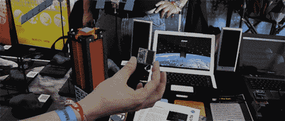

# 用于小行星探测的袖珍卫星

> 原文：<https://hackaday.com/2013/09/21/pocket-sized-sattelites-for-asteroid-detection/>

在之前，我们已经见过[kicks at，这是一种小型便携式单板卫星，旨在绕地球轨道运行。在今年的 Maker Faire 上，这些 kicksats 背后的团队有了一个新计划:利用它们来确定经过地球的小行星的轨道，希望不会给我们任何即将灭绝的预警。](http://hackaday.com/2011/10/11/send-a-satellite-into-space-for-300/)

这些 kicksats 的新计划不是简单地绕地球运行，而是将它们部署到一颗即将到来的小行星的路径上，例如 apop his T1，这样来自每颗卫星的无线电传输就可以精确地指出小行星的确切位置，这是地球上的光学和无线电望远镜难以解决的问题。

尽管尺寸很小，但每个 kicksat 上的硬件都令人印象深刻；每颗迷你卫星的两侧都有一个太阳能电池，一个带无线电模块的低功耗 MSP430 微控制器和一些传感器。该系统的设计使得任何人都可以通过一个小八木天线和一个 RTL SDR 电视调谐器转换器接收这些卫星的遥测数据。

这是一个令人印象深刻的工具，但是如果你更喜欢把卫星或小行星拿在手中，kicksat [背后的同一个团队发布了一大堆小行星和太空探测器的 3D 模型](http://www.thingiverse.com/3DPrinterGuy/collections/maker-faire-nyc-nasa-asteroid-grand-challenge-displays)。当它们被打印出来的时候，实际上是非常令人印象深刻的。