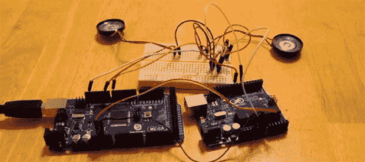

# 复调 Arduino 草图

> 原文：<https://hackaday.com/2013/10/20/polyphonic-arduino-sketches/>

为 Arduino 创作音乐很简单——只需使用 tone()库——但实际上听起来并没有那么好。这是因为这个库是单音的，使得和弦很难或者至少听起来有点怪。[Connor]的[miduino](http://miduino.net/)旨在改变这种情况，将原始的 MIDI 文件变成复音 Arduino 草图。

为了将 MIDI 文件转换成 Arduino 草图，[Connor]基于 [midiCSV](http://www.fourmilab.ch/webtools/midicsv/) 编写了一个 Python 脚本，该脚本读取 MIDI 文件的音符和通道，并将其转换成 Arduino 语言。与[的内置音调()库](http://arduino.cc/en/Reference/Tone)不同，miduino 是复音的，使得任何 Arduino 产生的音乐听起来都很棒。这基本上就是为 PC 音箱写歌和真键盘的区别；当然，你只能得到方波，但听起来好多了。

奇怪的是，据我们所知，[Connor]还没有发布他的 Python 脚本。所有的 MIDI 歌曲都在[康纳]自己的 Raspberry Pi 上进行转换。这应该比 VPS 便宜，并且是一个非常酷的项目。

编辑:米杜伊诺还不是复调的*，*但是【康纳】说他应该在一两周内完成。